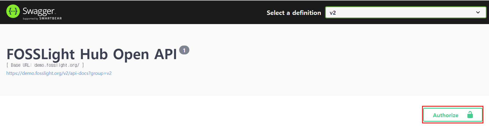
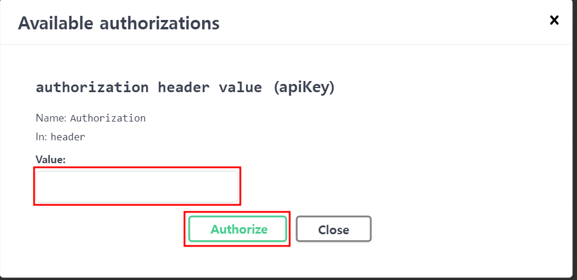
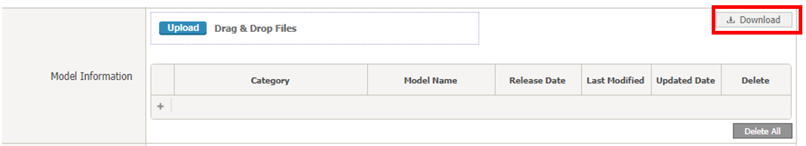

# REST API v2
To call the functions of FOSSLight, you can use the REST API.
  

## How to start  
{: .left-bar-title }  
To call the REST API, you need to issue a **TOKEN**. Please follow the steps below.
1. Log in with your **Admin account**
2. **In the System > User Management** tab, you can issue a **Token** for each **User**.

## REST API List  
{: .left-bar-title } 
Refer to the link below for API operation and return value.  
- For Demo service: <a href="https://demo.fosslight.org/swagger-ui/index.html?urls.primaryName=v2" target="_blank">https://demo.fosslight.org/swagger-ui/index.html?urls.primaryName=v2</a> (integration server : <a href="https://demo.fosslight.org/" target="_blank">https://demo.fosslight.org/</a>) 
- For FOSSLight Hub(LGE Only) : <a href="https://osc.lge.com/swagger-ui/index.html?urls.primaryName=v2" target="_blank">https://osc.lge.com/swagger-ui/index.html?urls.primaryName=v2</a> (integration server : <a href="http://osc.lge.com" target="_blank">http://osc.lge.com</a>)  
- For FOSSLight Hub Dev(LGE Only) : <a href="http://osc-dev.lge.com/swagger-ui/index.html?urls.primaryName=v2" target="_blank">http://osc-dev.lge.com/swagger-ui/index.html?urls.primaryName=v2</a> (integration server : <a href="http://osc-dev.lge.com" target="_blank">http://osc-dev.lge.com</a>)  
   
### 0. Header  
{: .specific-title }    
This is a feature provided to make authentication easier when using Swagger UI. If you are conducting tests with Curl or other API testing tools, you need to include the token information in the header for each API.   

<table>
    <tr>
        <th style="font-weight: bold; padding: 10px;">Key</th>
        <th style="font-weight: bold; padding: 10px;">Required</th>
        <th style="font-weight: bold; padding: 10px;">Type</th>
        <th style="font-weight: bold; padding: 10px;">Value</th>
    </tr>
    <tr>
        <td style="padding: 10px;">Authorization</td>
        <td style="padding: 10px; text-align: center;">O</td>
        <td style="padding: 10px;">String</td>
        <td style="padding: 10px;">Issued token information</td>
    </tr>
</table>  

- **How to Enter Token When Using Swagger UI**  
    - Click the Authorize button.  
    {: style="width:500px; height:150px;" .styled-image}  
    -  After entering the token information in the Value field of the popup, click the Authorize button.  
    {:  style="width:500px; height:250px;" .styled-image}   

### 1. Check OSS & License information  
{: .specific-title }   

<table>
    <thead>
        <tr style="background-color: #F0F0F0; color: black; font-weight: bold;">
            <th scope="col" style="width: 250px; padding: 5px;">API</th>
            <th scope="col" style="width: 80px; text-align: center; white-space: nowrap; padding: 5px;">Response format</th>
            <th scope="col" style="width: 700px; text-align: center; padding: 5px;">Description</th>
        </tr>
    </thead>
    <tbody>
        <tr style="background-color: white;">
            <td><a href="https://demo.fosslight.org/swagger-ui/index.html?urls.primaryName=v2#/1.%20OSS%20&%20License/getLicenseInfoUsingGET_1">GET /api/v2/license</a></td>
            <td style="text-align: center;">JSON</td>
            <td>
                Query the license information.  
                <ul class="description-list">
                    <li><strong class="highlight-black">licenseName</strong>: The name of the license to be queried</li>
                    <li><strong class="highlight-black">licenseNameExact</strong>: If set to true, only licenses that exactly match the value entered in licenseName will be listed(default = Y)</li>
                    <li><strong class="highlight-black">countPerPage</strong>: The number of items to be listed at once (default = 10000)</li>
                    <li><strong class="highlight-black">page</strong>: The page number to query (default = 1)</li>
                </ul>
            </td>
        </tr>
        <tr style="background-color: white;">
            <td><a href="https://demo.fosslight.org/swagger-ui/index.html?urls.primaryName=v2#/1.%20OSS%20&%20License/getOssInfoUsingGET_1">GET /api/v2/oss</a></td>
            <td style="text-align: center;">JSON</td>
            <td>
                Query Open Source information.  
                <ul class="description-list">
                    <li><strong class="highlight-black">downloadLocation</strong>: Value of the download location to query</li>
                    <li><strong class="highlight-black">downloadLocationExact</strong>: If set to true, only open source that exactly matches the value entered in downloadLocation will be listed (default = Y)</li>
                    <li><strong class="highlight-black">ossName</strong>: Name of the open source to query</li>
                    <li><strong class="highlight-black">ossNameExact</strong>: If set to true, only open source that exactly matches the value entered in ossName will be queried (default = Y)</li>
                    <li><strong class="highlight-black">ossVersion</strong>: Version of the open source to query</li>
                    <li><strong class="highlight-black">countPerPage</strong>: Number of items to be listed at once (default = 10000)</li>
                    <li><strong class="highlight-black">page</strong>: Page number to query (default = 1)</li>
                </ul>
            </td>
        </tr>
        <tr style="background-color: white;"> 
            <td><a href="https://demo.fosslight.org/swagger-ui/index.html?urls.primaryName=v2#/1.%20OSS%20&%20License/registerOssUsingPOST_1">POST /api/v2/oss</a></td>
            <td style="text-align: center;">JSON</td>
            <td>
                (Admin only) Register Open Source.  
                <ul class="description-list">
                    <li>Input data according to the ossMaster format</li>
                </ul>
            </td>
        </tr>
        <tr style="background-color: white;">
            <td><a href="https://demo.fosslight.org/swagger-ui/index.html?urls.primaryName=v2#/1.%20OSS%20&%20License/refineOssDownloadLocationUsingGET_1">GET /api/v2/refine-download-location</a></td>
            <td style="text-align: center;">JSON</td>
            <td>
                (Admin only) Refine OSS information.  
                <ul class="description-list">
                    <li><strong class="highlight-black">UPDATE DOWNLOAD LOCATION FORMAT</strong>: Update the Download location to match the format supported by Pre-review > Open Source.</li>
                    <li><strong class="highlight-black">REMOVE DUPLICATED DOWNLOAD LOCATION</strong>: Remove duplicate download locations.</li>
                    <li><strong class="highlight-black">PUT PURL</strong>: Update PURL.</li>
                    <li><strong class="highlight-black">REMOVE DUPLICATED PURL</strong>: If the same PURL is set, leave only the data with the shortest length of the download location and delete the duplicates.</li>
                    <li><strong class="highlight-black">REORDER GITHUB PRIORITY</strong>: If the download location contains "github.com" and the priority is not the first, change the priority.</li>
                    <li><strong class="highlight-black">REFINE ALL</strong>: Execute the above in order.</li>
                </ul>
            </td>
        </tr>
    </tbody>
</table>

### 2. Check 3rd Party information  
{: .specific-title }  

<table>
    <thead>
        <tr style="background-color: #F0F0F0; color: black; font-weight: bold;">
            <th scope="col" style="width: 250px; padding: 5px;">API</th>
            <th scope="col" style="width: 80px; text-align: center; white-space: nowrap; padding: 5px;">Response format</th>
            <th scope="col" style="width: 700px; text-align: center; padding: 5px;">Description</th>
        </tr>
    </thead>
    <tbody>
        <tr style="background-color: white;">
            <td><a href="https://demo.fosslight.org/swagger-ui/index.html?urls.primaryName=v2#/2.%203rd%20Party/getPartnersUsingGET">GET /api/v2/partners</a></td>
            <td style="text-align: center;">JSON</td>
            <td>
                Query 3rd Party information.  
                <ul class="description-list">
                    <li><strong class="highlight-black">createDate</strong>: Query based on the creation date of the 3rd party (fromDate-toDate)</li>
                    <li><strong class="highlight-black">creator</strong>: Query based on the information of the person who created it</li>
                    <li><strong class="highlight-black">division</strong>: Query based on division information</li>
                    <li><strong class="highlight-black">partnerIdList</strong>: Query based on the 3rd party ID. Multiple entries can be input in list format</li>
                    <li><strong class="highlight-black">status</strong>: Query based on the status of the 3rd party</li>
                    <li><strong class="highlight-black">updateDate</strong>: Query based on the update date of the 3rd party (fromDate-toDate)</li>
                    <li><strong class="highlight-black">countPerPage</strong>: Number of items to be listed at once (default = 1000)</li>
                    <li><strong class="highlight-black">page</strong>: Page number to query (default = 1)</li>
                </ul>
            </td>
        </tr>
        <tr style="background-color: white;">
            <td><a href="https://demo.fosslight.org/swagger-ui/index.html?urls.primaryName=v2#/2.%203rd%20Party/get3rdDownloadUsingGET">GET /api/v2/partners/{id}/bom/file</a></td>
            <td style="text-align: center;">FILE</td>
            <td>
                3rd party BOM export - Download in file format.  
                <ul class="description-list">
                    <li><strong class="highlight-black">(required) format</strong>: File format to extract</li>
                    <li><strong class="highlight-black">(required) id</strong>: 3rd party ID of the target to query</li>
                </ul>
            </td>
        </tr>
        <tr style="background-color: white;">
            <td><a href="https://demo.fosslight.org/swagger-ui/index.html?urls.primaryName=v2#/2.%203rd%20Party/get3rdAsJsonUsingGET">GET ​/api​/v2​/partners​/{id}​/bom/json-data</a></td>
            <td style="text-align: center;">JSON</td>
            <td>
                3rd party BOM export - Received in JSON format.  
                <ul class="description-list">
                    <li><strong class="highlight-black">(required) id</strong>: 3rd party ID of the target</li>
                </ul>
            </td>
        </tr>
        <tr style="background-color: white;">
            <td><a href="https://demo.fosslight.org/swagger-ui/index.html?urls.primaryName=v2#/2.%203rd%20Party/addPrjEditorUsingPOST">POST /api/v2/partners/{id}/editors</a></td>
            <td style="text-align: center;">JSON</td>
            <td>
                Add an editor to the 3rd party.  
                <ul class="description-list">
                    <li><strong class="highlight-black">(required) emailList</strong>: Email information of the editors to be added</li>
                    <li><strong class="highlight-black">(required) id</strong>: 3rd party ID of the target</li>
                </ul>
            </td>
        </tr>
    </tbody>
</table>

### 3. Check project information, upload OSS Report/Packaging, export/comparison of BOM  
{: .specific-title }  

<table>
    <thead>
        <tr style="background-color: #F0F0F0; color: black; font-weight: bold;">
            <th scope="col" style="width: 250px; padding: 5px;">API</th>
            <th scope="col" style="width: 80px; text-align: center; white-space: nowrap; padding: 5px;">Response format</th>
            <th scope="col" style="width: 700px; text-align: center; padding: 5px;">Description</th>
        </tr>
    </thead>
    <tbody>
        <tr style="background-color: white;">
            <td><a href="https://demo.fosslight.org/swagger-ui/index.html?urls.primaryName=v2#/3.%20Project/selectProjectListUsingGET_1">GET /api/v2/projects</a></td>
            <td style="text-align: center;">JSON</td>
            <td>
                Retrieve information about the Project including the following items:  
                <ul class="description-list">
                    <li><strong class="highlight-black">createDate</strong>: Query based on the date the Project was created (fromDate-toDate)</li>
                    <li><strong class="highlight-black">creator</strong>: Query based on the information of the person who created it</li>
                    <li><strong class="highlight-black">division</strong>: Query based on division information</li>
                    <li><strong class="highlight-black">modelName</strong>: Query based on the model name</li>
                    <li><strong class="highlight-black">prjIdList</strong>: Query based on project ID. Multiple IDs can be input in list form</li>
                    <li><strong class="highlight-black">prjName</strong>: Query based on the project name</li>
                    <li><strong class="highlight-black">prjNameExactYn</strong>: Set to true to retrieve only projects that exactly match the input project name</li>
                    <li><strong class="highlight-black">status</strong>: Query based on the status of the Project</li>
                    <li><strong class="highlight-black">updateDate</strong>: Query based on the date the Project was modified (fromDate-toDate)</li>
                    <li><strong class="highlight-black">countPerPage</strong>: Number of items to be listed at once (default = 1000, max = 1000)</li>
                    <li><strong class="highlight-black">page</strong>: Page number to query (default = 1)</li>
                </ul>
            </td>
        </tr>
        <tr style="background-color: white;">
            <td><a href="https://demo.fosslight.org/swagger-ui/index.html?urls.primaryName=v2#/3.%20Project/createProjectUsingPOST">POST /api/v2/projects</a></td>
            <td style="text-align: center;">JSON</td>
            <td>
                API for Project Creation. The generated project ID will be returned.  
                <ul class="description-list">
                    <li><strong class="highlight-black">additional Information</strong>: Additional information about the project</li>
                    <li><strong class="highlight-black">distributionSite</strong>: Select the distribution site (input as /api/v2/codes value)</li>
                    <li><strong class="highlight-black">distributionType</strong>: Select the distribution type (input as /api/v2/codes value)</li>
                    <li><strong class="highlight-black">networkServerType</strong>: Select whether it is a network server</li>
                    <li><strong class="highlight-black">noticeType</strong>: Select the type of notice (input as /api/v2/codes value)</li>
                    <li><strong class="highlight-black">noticeTypeEtc</strong>: If it is Platform-generate, select the type (input as /api/v2/codes value)</li>
                    <li><strong class="highlight-black">(required) osType</strong>: Select the OS type (input as /api/v2/codes value)</li>
                    <li><strong class="highlight-black">osTypeEtc</strong>: Additional OS type information</li>
                    <li><strong class="highlight-black">priority</strong>: Select priority based on the urgency of the project (input as /api/v2/codes value)</li>
                    <li><strong class="highlight-black">(required) prjName</strong>: Project name</li>
                    <li><strong class="highlight-black">prjVersion</strong>: Project version</li>
                    <li><strong class="highlight-black">publicYn</strong>: View Permission information (Y: Everyone, N: Creator & Editor) (default = Y)</li>
                    <li><strong class="highlight-black">userComment</strong>: User comment</li>
                </ul>
            </td>
        </tr>
        <tr style="background-color: white;">
            <td><a href="https://demo.fosslight.org/swagger-ui/index.html?urls.primaryName=v2#/3.%20Project/selectModelListUsingGET_1">GET /api/v2/projects/models</a></td>
            <td style="text-align: center;">JSON</td>
            <td>
                 Query model information for the Project.  
                <ul class="description-list">
                    <li><strong class="highlight-black">(required) prjIdList</strong>: Information of the project IDs to be queried. Multiple IDs can be input in list form.</li>
                </ul>
            </td>
        </tr>
        <tr style="background-color: white;">
            <td><a href="https://demo.fosslight.org/swagger-ui/index.html?urls.primaryName=v2#/3.%20Project/deleteProjectUsingDELETE">DELETE /api/v2/projects/{id}</a></td>
            <td style="text-align: center;">JSON</td>
            <td>
                Delete project (Only projects that have not been distributed can be deleted).  
                <ul class="description-list">
                    <li><strong class="highlight-black">(required) id</strong>: Target project ID</li>
                </ul>
            </td>
        </tr>
        <tr style="background-color: white;">
            <td><a href="https://demo.fosslight.org/swagger-ui/index.html?urls.primaryName=v2#/3.%20Project/getPrjBomCompareUsingGET_1">GET /api/v2/projects/{id}/bom/compare-with/{compareId}</a></td>
            <td style="text-align: center;">JSON</td>
            <td>
                Project BOM Compare.  
                <ul class="description-list">
                    <li><strong class="highlight-black">(required) compareId</strong>: Project ID to be compared</li>
                    <li><strong class="highlight-black">(required) id</strong>: Reference project ID</li>
                </ul>
            </td>
        </tr>
        <tr style="background-color: white;">
            <td><a href="https://demo.fosslight.org/swagger-ui/index.html?urls.primaryName=v2#/3.%20Project/getPrjBomDownloadUsingGET">GET /api/v2/projects/{id}/bom/file</a></td>
            <td style="text-align: center;">JSON</td>
            <td>
                Project BOM export - Download in file format.  
                <ul class="description-list">
                    <li><strong class="highlight-black">(required) format</strong>: File format to be extracted</li>
                    <li><strong class="highlight-black">(required) id</strong>: Target project ID</li>
                    <li><strong class="highlight-black">saveFlag</strong>: Choose whether to update the BOM based on the information at the time of API execution (default = Y)</li>
                </ul>
            </td>
        </tr>
       <tr style="background-color: white;">
            <td><a href="https://demo.fosslight.org/swagger-ui/index.html?urls.primaryName=v2#/3.%20Project/getPrjBomAsJsonUsingGET">GET /api/v2/projects/{id}/bom/json-data</a></td>
            <td style="text-align: center;">JSON</td>
            <td>
                Project BOM export - Received in JSON format.  
                <ul class="description-list">
                    <li><strong class="highlight-black">(required) id</strong>: Target project ID</li>
                    <li><strong class="highlight-black">saveFlag</strong>: Choose whether to update the BOM based on the information at the time of API execution (default = Y)</li>
                </ul>
            </td>
        </tr>
        <tr style="background-color: white;">
            <td><a href="https://demo.fosslight.org/swagger-ui/index.html?urls.primaryName=v2#/3.%20Project/addPrjEditorUsingPOST_1">POST /api/v2/projects/{id}/editors</a></td>
            <td style="text-align: center;">JSON</td>
            <td>
                Add an editor to the project.  
                <ul class="description-list">
                    <li><strong class="highlight-black">(required) emailList</strong>: Email information of the editors to be added</li>
                    <li><strong class="highlight-black">(required) id</strong>: Target project ID</li>
                </ul>
            </td>
        </tr>
        <tr style="background-color: white;">
            <td><a href="https://demo.fosslight.org/swagger-ui/index.html?urls.primaryName=v2#/3.%20Project/updateModelListUsingPOST_1">POST /api/v2/projects/{id}/models</a></td>
            <td style="text-align: center;">JSON</td>
            <td>
                Update the project's Model information through a list of model information strings. 
                (Note: This will only add models; they will not be distributed. If distribution is needed after adding model information, please go to the Distribution tab and proceed with distribution.)  
                <ul class="description-list">
                    <li><strong class="highlight-black">(required) id</strong>: Target project ID</li>
                    <li><strong class="highlight-black">(required) modelListToUpdate</strong>: Model information string list (format: MODEL_NAME|Category|Release Date) - ex. MODEL_NAME|ETC > Etc|20220428</li>
                </ul>
            </td>
        </tr>
        <tr style="background-color: white;">
            <td><a href="https://demo.fosslight.org/swagger-ui/index.html?urls.primaryName=v2#/3.%20Project/updateModelListUploadFileUsingPOST_1">POST ​/api​/v2​/projects​/{id}​/models​/upload</a></td>
            <td style="text-align: center;">JSON</td>
            <td>
                Update the project's Model information using a Model List Excel file. 
                (Note: This will only add models; they will not be distributed. If distribution is needed after adding model information, please go to the Distribution tab and proceed with distribution.)  
                <ul class="description-list">
                    <li><strong class="highlight-black">(required) id</strong>: Target project ID</li>
                    <li><strong class="highlight-black">(required) modelReport</strong>: Excel file of the Model List: Project > Project Information tab > Click the Download button</li>
                </ul>
                
            </td>
        </tr>
        <tr style="background-color: white;">
            <td><a href="https://demo.fosslight.org/swagger-ui/index.html?urls.primaryName=v2#/3.%20Project/getProjectNoticeUsingGET">GET /api/v2/projects/{id}/notice</a></td>
            <td style="text-align: center;">JSON</td>
            <td>
                Notice for receiving files for the project ID  
                <ul class="description-list">
                    <li><strong class="highlight-black">(required) id</strong>: Target project ID</li>
                </ul>
            </td>
        </tr>
        <tr style="background-color: white;">
            <td><a href="https://demo.fosslight.org/swagger-ui/index.html?urls.primaryName=v2#/3.%20Project/ossUploadPackageUsingPOST">POST /api/v2/projects/{id}/packages</a></td>
            <td style="text-align: center;">JSON</td>
            <td>
                Upload a package file to the project.  
                <ul class="description-list">
                    <li><strong class="highlight-black">packageFile</strong>: Package file to be uploaded</li>
                    <li><strong class="highlight-black">(required) id</strong>: Target project ID</li>
                    <li><strong class="highlight-black">verifyFlag</strong>: Choose whether to verify the uploaded file (default = N)</li>
                </ul>
            </td>
        </tr>
        <tr style="background-color: white;">
            <td><a href="https://osc.lge.com/swagger-ui/index.html?urls.primaryName=v2#/3.%20Project/getPrjSecurityExportJsonUsingGET_1">GET /api/v2/projects/{id}/security/json-data</a></td>
            <td style="text-align: center;">JSON</td>
            <td>
                Query security vulnerability information detected in the project in JSON format  
                <ul class="description-list">
                    <li><strong class="highlight-black">(required) id</strong>: Target project ID</li>
                </ul>
            </td>
        </tr>
        <tr style="background-color: white;">
            <td><a href="https://demo.fosslight.org/swagger-ui/index.html?urls.primaryName=v2#/3.%20Project/ossLoadUsingPOST">POST /api/v2/projects/{id}/{tab_name}/oss-load</a></td>
            <td style="text-align: center;">-</td>
            <td>
                Load open-source information reviewed in previous projects into the project (Only projects with identification confirmed can be loaded).  
                <ul class="description-list">
                    <li><strong class="highlight-black">(required) id</strong>: Target project ID</li>
                    <li><strong class="highlight-black">prjToLoad</strong>: Project ID to load (input if the search condition is id)</li>
                    <li><strong class="highlight-black">prjNameToLoad</strong>: Project name to load (input if the search condition is name)</li>
                    <li><strong class="highlight-black">prjVersionToLoad</strong>: Project version to load (input if the search condition is name)</li>
                    <li><strong class="highlight-black">resetFlag</strong>: Whether to reset existing entered information when loading (default = Y). N - Append while maintaining existing OSS Table entries</li>
                    <li><strong class="highlight-black">(required) searchCondition</strong>: Criteria for searching the project to load</li>
                    <li><strong class="highlight-black">(required) tab_name</strong>: Target tab name (bin/dep/src)</li>
                </ul>
            </td>
        </tr>
        <tr style="background-color: white;">
            <td><a href="https://demo.fosslight.org/swagger-ui/index.html?urls.primaryName=v2#/3.%20Project/ossReportAllUsingPOST">POST /api/v2/projects/{id}/{tab_name}/reports</a></td>
            <td style="text-align: center;">-</td>
            <td>
                Upload an open-source analyzed report file to the project.  
                <ul class="description-list">
                    <li><strong class="highlight-black">ossReport</strong>: Report file to be uploaded</li>
                    <li><strong class="highlight-black">comment</strong>: User comment</li>
                    <li><strong class="highlight-black">(required) id</strong>: Target project ID</li>
                    <li><strong class="highlight-black">resetFlag</strong>: Whether to reset existing entered information when uploading the file (default = Y). N - Append while maintaining existing OSS Table entries</li>
                    <li><strong class="highlight-black">sheetNames</strong>: If you want to update specific sheet names from the uploaded report file, input here. If not entered, information will be loaded based on the default prefixes DEP, SRC, BIN. Multiple sheets can be entered, separated by commas.</li>
                    <li><strong class="highlight-black">(required) tab_name</strong>: Target tab name</li>
                </ul>
            </td>
        </tr>
        <tr style="background-color: white;">
            <td><a href="https://demo.fosslight.org/swagger-ui/index.html?urls.primaryName=v2#/3.%20Project/identificationResetUsingPOST">POST /api/v2/projects/{id}/{tab_name}/reset</a></td>
            <td style="text-align: center;">-</td>
            <td>
                Reset the tab selected in Project > Identification.  
                <ul class="description-list">
                    <li><strong class="highlight-black">(required) id</strong>: Target project ID</li>
                    <li><strong class="highlight-black">(required) tab_name</strong>: Target tab name</li>
                </ul>
            </td>
        </tr>
    </tbody>
</table>

### 4. Check Vulnerability information  
{: .specific-title }  

<table>
    <thead>
        <tr style="background-color: #F0F0F0; color: black; font-weight: bold;">
            <th scope="col" style="width: 250px; padding: 5px;">API</th>
            <th scope="col" style="width: 80px; text-align: center; white-space: nowrap; padding: 5px;">Response format</th>
            <th scope="col" style="width: 700px; text-align: center; padding: 5px;">Description</th>
        </tr>
    </thead>
    <tbody>
        <tr style="background-color: white;">
            <td><a href="https://demo.fosslight.org/swagger-ui/index.html?urls.primaryName=v2#/4.%20Vulnerability/getVulnerabilityMaxDataUsingGET_1">GET /api/v2/max-vulnerabilities</a></td>
            <td style="text-align: center;">JSON</td>
            <td>
                Check the maximum score and CVE ID by OSS Name and Version.  
                <ul class="description-list">
                    <li><strong class="highlight-black">(required) OSS Name</strong>: Name of the open source to query</li>
                    <li><strong class="highlight-black">OSS Version</strong>: Version of the open source to query</li>
                </ul>
            </td>
        </tr>
        <tr style="background-color: white;">
            <td><a href="https://demo.fosslight.org/swagger-ui/index.html?urls.primaryName=v2#/4.%20Vulnerability/getVulnerabilityDataUsingGET_4">GET /api/v2/vulnerabilities</a></td>
            <td style="text-align: center;">JSON</td>
            <td>
                Query the CVE ID, CVSS Score, CVE ID Link, and OSS Information (OSS Name, OSS Version and Nickname) by OSS Name and Version or CVE ID.  
                <ul class="description-list">
                    <li><strong class="highlight-black">cveId</strong>: CVE ID to query</li>
                    <li><strong class="highlight-black">ossName</strong>: Name of the open source to query</li>
                    <li><strong class="highlight-black">ossVersion</strong>: Version of the open source to query</li>
                </ul>
            </td>
        </tr>
    </tbody>
</table>

### 5. Create Self-Check and register OSS Report  
{: .specific-title }  

<table>
    <thead>
        <tr style="background-color: #F0F0F0; color: black; font-weight: bold;">
            <th scope="col" style="width: 250px; padding: 5px;">API</th>
            <th scope="col" style="width: 80px; text-align: center; white-space: nowrap; padding: 5px;">Response format</th>
            <th scope="col" style="width: 700px; text-align: center; padding: 5px;">Description</th>
        </tr>
    </thead>
    <tbody>
        <tr style="background-color: white;">
            <td><a href="https://demo.fosslight.org/swagger-ui/index.html?urls.primaryName=v2#/5.%20SelfCheck/createSelfCheckUsingPOST">POST /api/v2/selfchecks</a></td>
            <td style="text-align: center;">JSON</td>
            <td>
                Create a Self-Check Project and receive the generated Self-Check ID.  
                <ul class="description-list">
                    <li><strong class="highlight-black">(required) prjName</strong>: Self-Check project name</li>
                    <li><strong class="highlight-black">prjVersion</strong>: Self-Check project version</li>
                </ul>
            </td>
        </tr>
        <tr style="background-color: white;">
            <td><a href="https://demo.fosslight.org/swagger-ui/index.html?urls.primaryName=v2#/5.%20SelfCheck/getSelfcheckUsingGET">GET /api/v2/selfchecks/{id}</a></td>
            <td style="text-align: center;">JSON</td>
            <td>
                Query the Self-Check project.  
                <ul class="description-list">
                    <li><strong class="highlight-black">(required) id</strong>: Self-Check project ID to query</li>
                </ul>
            </td>
        </tr>
       <tr style="background-color: white;">
            <td><a href="https://demo.fosslight.org/swagger-ui/index.html?urls.primaryName=v2#/5.%20SelfCheck/selfCheckBomDownloadUsingGET">GET /api/v2/selfchecks/{id}/bom/file</a></td>
            <td style="text-align: center;">FILE</td>
            <td>
                Download the result file exported from Self-Check.  
                <ul class="description-list">
                    <li><strong class="highlight-black">(required) id</strong>: Self-Check project ID to query</li>
                </ul>
            </td>
        </tr>
        <tr style="background-color: white;">
            <td><a href="https://demo.fosslight.org/swagger-ui/index.html?urls.primaryName=v2#/5.%20SelfCheck/addPrjEditorUsingPOST_2">POST /api/v2/selfchecks/{id}/editors</a></td>
            <td style="text-align: center;">-</td>
            <td>
                Add editors to Self-Check.  
                <ul class="description-list">
                    <li><strong class="highlight-black">(required) emailList</strong>: Email information of the editor to add</li>
                    <li><strong class="highlight-black">(required) id</strong>: Target project ID</li>
                </ul>
            </td>
        </tr>
        <tr style="background-color: white;">
            <td><a href="https://demo.fosslight.org/swagger-ui/index.html?urls.primaryName=v2#/5.%20SelfCheck/ossReportSelfCheckUsingPOST_1">POST /api/v2/selfchecks/{id}/report</a></td>
            <td style="text-align: center;">-</td>
            <td>
                Upload the analyzed open source report file to Self-Check.  
                <ul class="description-list">
                    <li><strong class="highlight-black">ossReport</strong>: Report file to upload</li>
                    <li><strong class="highlight-black">(required) id</strong>: Target Self-Check project ID</li>
                    <li><strong class="highlight-black">resetFlag</strong>: Whether to reset existing information when uploading the file. N - Append to the existing OSS Table without resetting (default = Y)</li>
                    <li><strong class="highlight-black">sheetNames</strong>: If you want to update specific sheet names from the report file to upload, enter them here. If not entered, information will be fetched based on the default prefixes DEP, SRC, BIN. Multiple sheets can be entered separated by commas (,).</li>
                </ul>
            </td>
        </tr>
    </tbody>
</table>

### 6. Check the value of the code used when using API  
{: .specific-title }  

<table>
    <thead>
        <tr style="background-color: #F0F0F0; color: black; font-weight: bold;">
            <th scope="col" style="width: 250px; padding: 5px;">API</th>
            <th scope="col" style="width: 80px; text-align: center; white-space: nowrap; padding: 5px;">Response format</th>
            <th scope="col" style="width: 700px; text-align: center; padding: 5px;">Description</th>
        </tr>
    </thead>
    <tbody>
        <tr style="background-color: white;">
            <td><a href="https://demo.fosslight.org/swagger-ui/index.html?urls.primaryName=v2#/6.%20Code%20v2/getVulnerabilityDataUsingGET_3">GET /api/v2/codes</a></td>
            <td style="text-align: center;">JSON</td>
            <td>
                Query the list of values for the following parameters to be used when creating a project and querying 3rd Party in Self-Check.  
                <ul class="description-list">
                    <li><strong class="highlight-black">(required) codeType</strong>: Enter the abbreviation for the category of the code you want to query.</li>
                    <ul>
                        <li>Division: DIV</li>
                        <li>OS Type: OS</li>
                        <li>Distribution Type: DSTT</li>
                        <li>Distribution Site: DSTS</li>
                        <li>Notice Type: NOTI</li>
                        <li>Notice Platform: NP</li>
                        <li>Priority: PRI</li>
                    </ul>
                    <li><strong class="highlight-black">detailValue</strong>: Input among the values in the category (codeType).</li>
                </ul>
            </td>
        </tr>
    </tbody>
</table>

### 7. Check Binary DB  
{: .specific-title }  

<table>
    <thead>
        <tr style="background-color: #F0F0F0; color: black; font-weight: bold;">
            <th scope="col" style="width: 250px; padding: 5px;">API</th>
            <th scope="col" style="width: 80px; text-align: center; white-space: nowrap; padding: 5px;">Response format</th>
            <th scope="col" style="width: 700px; text-align: center; padding: 5px;">Description</th>
        </tr>
    </thead>
    <tbody>
        <tr style="background-color: white;">
            <td><a href="https://demo.fosslight.org/swagger-ui/index.html?urls.primaryName=v2#/7.%20Binary/getBinaryInfoUsingGET_1">GET /api/v2/binaries</a></td>
            <td style="text-align: center;">JSON</td>
            <td>
                Query based on the following information from the Binary DB.  
                <ul class="description-list">
                    <li><strong class="highlight-black">Binary Name</strong></li>
                    <li><strong class="highlight-black">Checksum</strong></li>
                    <li><strong class="highlight-black">TLSH</strong></li>
                    <li><strong class="highlight-black">License</strong></li>
                    <li><strong class="highlight-black">Download Location</strong></li>
                    <li><strong class="highlight-black">OSS Name</strong></li>
                    <li><strong class="highlight-black">OSS Version</strong></li>
                    <li><strong class="highlight-black">Project Name</strong></li>
                </ul>
            </td>
        </tr>
    </tbody>
</table>

### 8. Compliance Status  
{: .specific-title }  

<table>
    <thead>
        <tr style="background-color: #F0F0F0; color: black; font-weight: bold;">
            <th scope="col" style="width: 250px; padding: 5px;">API</th>
            <th scope="col" style="width: 80px; text-align: center; white-space: nowrap; padding: 5px;">Response format</th>
            <th scope="col" style="width: 700px; text-align: center; padding: 5px;">Description</th>
        </tr>
    </thead>
    <tbody>
       <tr style="background-color: white;">
            <td>(enterprise only)POST /api/v2/compliance/3rdparty-status</td>
            <td style="text-align: center;">JSON</td>
            <td>
                Query 3rd Party Status using the 3rd Party creation date and Division.  
                <ul class="description-list">
                    <li><strong class="highlight-black">division</strong>: Enter the value from /api/v2/codes</li>
                    <li><strong class="highlight-black">schEndDate</strong>: Search range (based on creation date)</li>
                    <li><strong class="highlight-black">schStartDate</strong>: Search range (based on creation date)</li>
                </ul>
            </td>
        </tr>
        <tr style="background-color: white;">
            <td>(enterprise only)POST /api/v2/compliance/product-status</td>
            <td style="text-align: center;">JSON</td>
            <td>
                Query Product Status using the Project creation date, Model release date, and Division.  
                <ul class="description-list">
                    <li><strong class="highlight-black">division</strong>: Enter the value from /api/v2/codes</li>
                    <li><strong class="highlight-black">modelDistributedEndDate</strong>: Search range (based on distribution date)</li>
                    <li><strong class="highlight-black">modelDistributedStartDate</strong>: Search range (based on distribution date)</li>
                    <li><strong class="highlight-black">modelListInfo</strong>: Search for model information</li>
                    <li><strong class="highlight-black">schEndDate</strong>: Search range (based on creation date)</li>
                    <li><strong class="highlight-black">schStartDate</strong>: Search range (based on creation date)</li>
                </ul>
            </td>
        </tr>
    </tbody>
</table>

## Error code  
{: .left-bar-title } 
In case of an error, an HTTP Response Code other than 2xx will be returned.
