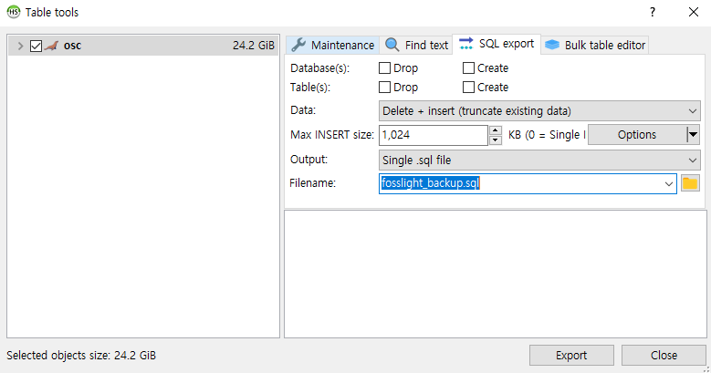

# Maintenance
```note
A useful guide to operating the FOSSLight Hub.
```

## DB backup and recovery
### 1. Backup 
#### Option 1. Full DB backup    
mysqldump -u[id] -p[password] [database_name] > [backup_file_name].sql
```
$ mysqldump -ufosslight -pfosslight fosslight > fosslight_backup.sql
```

#### Option 2. DB backup for updating to the latest version of FOSSLight (data only)
1. Download DBMS. (Recommended DBMS: HeidiSQL https://github.com/HeidiSQL/HeidiSQL)
2. After connecting to the DB, click 'Export database as SQL'.
3. Extract data with DELETE + INSERT.
    

### 2. Recovery
1. Create a new empty DB to reflect the table structure according to the version and set the default values:

   [Developer Documentation - Download & Installation - 4. Create Database and Initial Data Registration](../advanced/1_developer.md#download--installation)

2. Restore the backup file:
   
    mysql -u[id] -p[password] [database_name] < [backup_file_name].sql

    ```
    $ mysql -ufosslight -pfosslight fosslight < fosslight_backup.sql
    ```

## Upgrading the DB version
How to upgrade DB version using [MyBatis Migrations](https://mybatis.org/migrations/migrate.html) (It is provided from the version that migrates from v1.5.0.)

1. Modify DB connection information in migration/migration/environments/development.properties file.
    ```
    $ cd migration/migration
    $ cat environments/development.properties
    ## Base time zone to ensure times are consistent across machines
    time_zone=GMT+0:00

    ## The character set that scripts are encoded with
    # script_char_set=UTF-8

    ## JDBC connection properties.
    driver=org.mariadb.jdbc.Driver
    url=jdbc:mysql://localhost:3306/fosslight
    username=fosslight
    password=fosslight
    ```
2. Export the fosslight/migration/mybatis-migrations-3.3.11 folder to MIGRATIONS_HOME.
    ```
    $ cd fosslight
    $ pwd
    $ /home/test/fosslight
    $ export MIGRATIONS_HOME=/home/test/fosslight/migration/mybatis-migrations-3.3.11
    $ export MIGRATIONS=$MIGRATIONS_HOME/bin
    $ export PATH=$MIGRATIONS:$PATH
    ```
3. Check the migration status, keep only the migration scripts to be applied, and delete the rest of the scripts
    ```
    $ cd /home/test/fosslight/migration/migration
    $ migrate status
    ------------------------------------------------------------------------
    -- MyBatis Migrations - status
    ------------------------------------------------------------------------
    ID             Applied At          Description
    ================================================================================
    20230322085317    ...pending...    create changelog
    20230322092534    ...pending...    update v1.6.0
    20230818004358    ...pending...    update v1.6.1
    20240401085317    ...pending...    update 2.0.0-beta
    20240702085317    ...pending...    update v2.0.0.pre-release
    20240724045922    ...pending...    update v2.0.0.pre-release version oss components table
    20240725150921    ...pending...    update v2.0.0
    
    ------------------------------------------------------------------------
    -- MyBatis Migrations SUCCESS
    -- Total time: 0s
    -- Finished at: Mon Oct 07 10:22:07 KST 2024
    -- Final Memory: 7M/500M
    ------------------------------------------------------------------------
   
    $ cd scripts/
    $ rm 20230322092534_update_v1.6.0.sql
    $ rm 20230818004358_update_v1.6.1.sql
    ```

4. Upgrade using the migrate up command
    ```
    $ migrate up
    ------------------------------------------------------------------------
    -- MyBatis Migrations - up
    ------------------------------------------------------------------------
    ========== Applying: 20230322085317_create_changelog.sql =======================
    -- // Create Changelog
    -- Default DDL for changelog table that will keep
    -- a record of the migrations that have been run.
    -- You can modify this to suit your database before
    
    ...
    
    ------------------------------------------------------------------------
    -- MyBatis Migrations SUCCESS
    -- Total time: 2s
    -- Finished at: Mon Oct 07 10:22:47 KST 2024
    -- Final Memory: 8M/500M
    ------------------------------------------------------------------------
    ```

5. Check if the version up has been applied.
    ```
    $ migrate status
    ------------------------------------------------------------------------
    -- MyBatis Migrations - status
    ------------------------------------------------------------------------
    ID             Applied At          Description
    ================================================================================
    20230322085317 2024-10-07 10:22:45 create changelog
    20240401085317 2024-10-07 10:22:45 update 2.0.0-beta
    20240702085317 2024-10-07 10:22:45 update v2.0.0.pre-release
    20240724045922 2024-10-07 10:22:45 update v2.0.0.pre-release version oss components table
    20240725150921 2024-10-07 10:22:47 update v2.0.0
    
    ------------------------------------------------------------------------
    -- MyBatis Migrations SUCCESS
    -- Total time: 0s
    -- Finished at: Mon Oct 07 10:24:19 KST 2024
    -- Final Memory: 7M/500M
    ------------------------------------------------------------------------
    ```

✏️Note. For detailed commands, see [MyBatis Migrations](https://mybatis.org/migrations/migrate.html).

## Download NVD Data from 2002
FOSSLight Hub downloads [NVD Data Feeds](https://nvd.nist.gov/vuln/data-feeds) provided from NVD(NATIONAL VULNERABILITY DATABASE) once a day and stores them in the database, and the stored NVD data is viewed in the [Vulnerability List](../menu/7_vulnerability.md).    
At this time, when downloading NVD data from 2002 data, set as follows.      
(If you set it only once for the first time, there is no need to set it additionally because the data will be accumulated afterwards.)           
        
**Change the setting value in DB**    
```
UPDATE T2_CODE_DTL SET CD_DTL_NM = 'Y' WHERE CD_NO = '990' AND CD_DTL_NO = '100';
```
The default value of NVD Data Feed initialize flag Code is set to “N”, and if you change it to “Y” directly as above, all NVD data is cleaned during the next NVD schedule operation, and registration is processed sequentially from the 2002 data file.     
The value is changed to the default value ("N") regardless of whether there is an error when performing NVD Data initialization.     
