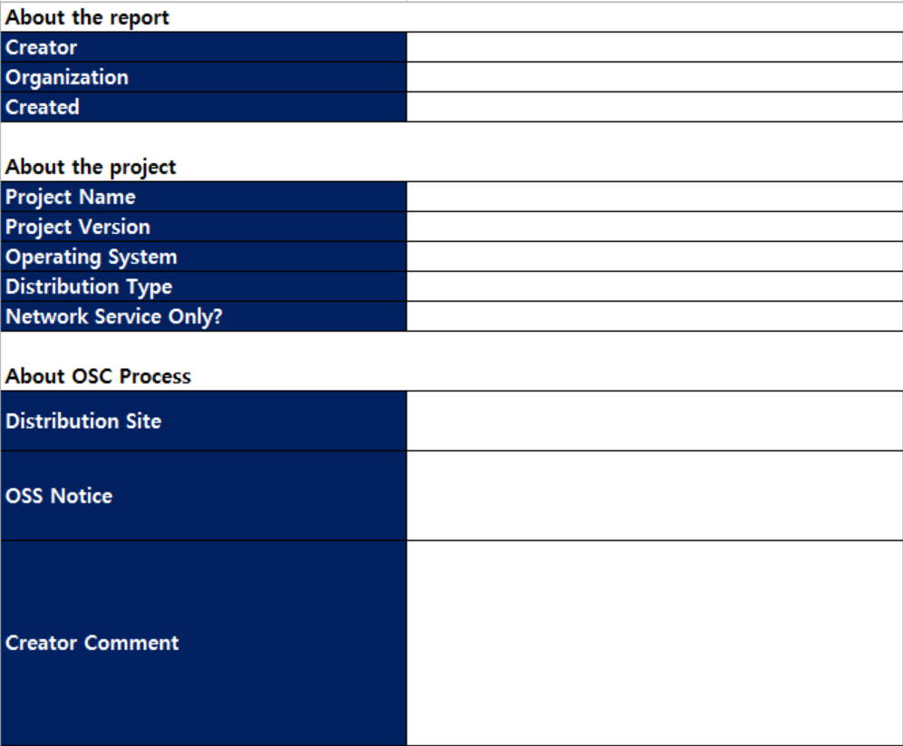
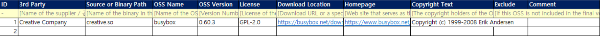
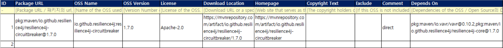
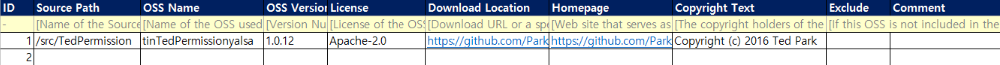
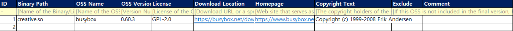
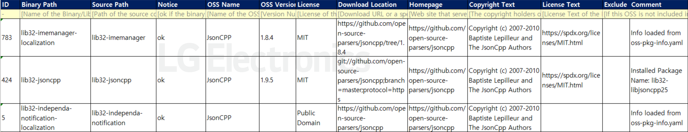
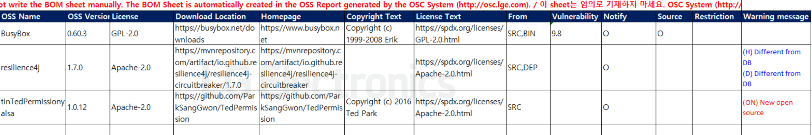

# FOSSLight Report  
- FOSSLight Report is a template used by FOSSLight Hub and FOSSLight Scanner to identify the usage status of Open Source per project, and is also referred to as an 'OSS Report'.  
- Version 3.3: [Fosslight_Report.xlsx](https://github.com/fosslight/fosslight/raw/main/src/main/resources/template/ProjectReport.xlsx)

## Sheet Structure 
{: .left-bar-title }  

### Project Info Sheet
{: .specific-title}  
- Fill in the project information.  
  

### 3rd Party Sheet  
{: .specific-title}   
- If the project includes software provided by a 3rd party, obtain the OSS Checklist from the 3rd party to identify what Open Sources are used.  
- The identified Open Source information is registered in the [3rd Party](../menu/5_third-party.md) menu of FOSSLight Hub and is collected in the Project > Identification > [3rd Party tab](../tutorial/1_project/2_Identification/1_3rd_Party_Tab.md).
- When the FOSSLight Report is exported from FOSSLight Hub > Project > Identification, the information registered in the 3rd Party tab is automatically filled in the "3rd party" sheet. Therefore, do not manually fill in the "3rd party" sheet.      
  

### DEP Sheet
{: .specific-title}
- Upload the Dependency analysis results.  
  
   - [FOSSLight Dependency Scanner](https://fosslight.org/fosslight-guide-en/scanner/3_dependency.html) can be used to automatically generate "DEP" sheet.  

### SRC Sheet
{: .specific-title}
- Fill in the Open Source information included per Source Code.   
  
   - [FOSSLight Source Scanner](https://fosslight.org/fosslight-guide-en/scanner/2_source.html) can be used to automatically generate the "SRC" sheet.   

### BIN Sheet
{: .specific-title}
- Fill in the Open Source information included per Binary.   
 
   - [FOSSLight Binary Scanner](https://fosslight.org/fosslight-guide-en/scanner/4_binary.html) can be used to automatically generate the "BIN" sheet.  

### BIN(Android) Sheet
{: .specific-title}
- Fill in the Open Source information for Android Platform Project and Yocto Project.  
 
   - [FOSSLight Android Scanner](https://fosslight.org/fosslight-guide-en/scanner/6_android.html) and [FOSSLight Yocto Scanner](https://fosslight.org/fosslight-guide-en/scanner/5_yocto.html) can be used to automatically generate the "BIN(Android)" or "BIN(Yocto)" sheets.
   - For Android Platform and Yocto-based models (such as phones and TVs), the DEP, SRC, and BIN sheets do not need to be filled in.  

### BOM Sheet
{: .specific-title}
- BOM (Bill of Materials) is generated by collecting the Open Source information from each sheet in the FOSSLight Report.  
- As the BOM is automatically filled in when exporting the FOSSLight Report from the Project in FOSSLight Hub, manual editing is not necessary.   
  

## Sheet Content Creation
{: .left-bar-title }  
By using [FOSSLight Scanner](https://fosslight.org/fosslight-guide/scanner/), DEP, SRC, and BIN sheets can be automatically generated at the same time. However, you must manually check and supplement any missing or inaccurate information.  
  

### Common Requirements
{: .specific-title}  

<table border="1" cellspacing="0" cellpadding="8" style="border-collapse: collapse; width: 100%;">
  <thead>
    <tr>
      <th style="padding: 12px;">Column Name</th>
      <th style="padding: 12px;">Description</th>
    </tr>
  </thead>
  <tbody>
    <tr>
      <td style="padding: 12px;">OSS Name</td>
      <td style="padding: 12px;">
         • Fill in the OSS Name based on the name specified on the website from which the Open Source was downloaded. 
         • Utilize the <a href="../tips/1_common/2_pre_review/">Pre-Review</a> feature to identify the OSS Name through download location information. 
         • If the License text exists but the Open Source name or origin is unclear, fill in the OSS Name with a hyphen ("-"). 
         

            – Fill in all other information such as License and Copyright. 
            – This applies only if the License is Permissive. For Copyleft Licenses like GPL or LGPL, accurately confirm the OSS Name and origin to determine the scope of source code disclosure.
         

         • If no Open Source was used, fill in a hyphen ("-") in the OSS Name field.
      </td>
    </tr>
    <tr>
      <td style="padding: 12px;">OSS Version</td>
      <td style="padding: 12px;">• Fill in the version of the Open Source used.</td>
    </tr>
    <tr>
      <td style="padding: 12px;">License</td>
      <td style="padding: 12px;">
        • If multiple Licenses apply to a single Open Source, separate them with commas (",").  
        • If no Open Source was used, fill in "LGE Proprietary License", or "Other Proprietary License" if developed by a third party.  
      </td>
    </tr>
    <tr>
      <td style="padding: 12px;">Download Location</td>
      <td style="padding: 12px;">• Fill in the URL where the Open Source of the specified OSS version can be downloaded.</td>
    </tr>
    <tr>
      <td style="padding: 12px;">Homepage</td>
      <td style="padding: 12px;">• Fill in the official website URL of the Open Source project.</td>
    </tr>
    <tr>
      <td style="padding: 12px;">Copyright Text</td>
      <td style="padding: 12px;">• Fill in the copyright information of the Open Source.</td>
    </tr>
    <tr>
      <td style="padding: 12px;">License Text</td>
      <td style="padding: 12px;">• If the License is not registered in FOSSLight Hub, fill in a link to the original License text or the License text itself.</td>
    </tr>
    <tr>
      <td style="padding: 12px;">Exclude</td>
      <td style="padding: 12px;">• Check this box if the Open Source is not included in the software(including products) to be distributed.</td>
    </tr>
  </tbody>
</table>

### Sheet-Specific Content Creation  
{: .specific-title}

#### Project Info Sheet
   - **About the Report**: Fill in the author/department and date of creation.
   - **About the Project**: Fill in the information about the development project.

  
Detailed Content Creation

  <table border="1" cellspacing="0" cellpadding="8" style="border-collapse: collapse; width: 100%; margin-top: 10px;">
    <thead>
      <tr>
        <th style="padding: 12px;">Item</th>
        <th style="padding: 12px;">Description</th>
      </tr>
    </thead>
    <tbody>
      <tr>
        <td style="padding: 12px;">Project Name</td>
        <td style="padding: 12px;">
          • Fill in the name of the project. If the model name and project name are the same, use the model name.
        </td>
      </tr>
      <tr>
        <td style="padding: 12px;">Project Version</td>
        <td style="padding: 12px;">
          • Fill in the version of the project. Leave blank if there is no version information.  
        </td>
      </tr>
      <tr>
        <td style="padding: 12px;">Operating System</td>
        <td style="padding: 12px;">
          • Select the operating system of the project (e.g., Android 7.0, webOS 3.0, Linux 3.4, iOS Application).
        </td>
      </tr>
      <tr>
        <td style="padding: 12px;">Distribution Type</td>
        <td style="padding: 12px;">
          • Choose the distribution type of the project.
          

            • General Model: For general B2C models 
            • Transfer in-house: For internal transfers 
            • B2B: For B2B models 
            • Preceding Software: For pre-development without planned distribution 
            • Self-Check: For internal review and pre-verification, not for external distribution
          

        </td>
      </tr>
      <tr>
        <td style="padding: 12px;">Network Service Only?</td>
        <td style="padding: 12px;">
          • If the project is a network service (e.g., Web Service), select 'Yes'.
        </td>
      </tr>
    </tbody>
  </table>

   - **About OSC Process**: Fill in the information about the Open Source Compliance(OSC) process.

  
Detailed Content Creation

  <table border="1" cellspacing="0" cellpadding="8" style="border-collapse: collapse; width: 100%;">
    <thead>
      <tr>
        <th style="padding: 12px;">Item</th>
        <th style="padding: 12px;">Description</th>
      </tr>
    </thead>
    <tbody>
      <tr>
        <td style="padding: 12px;">Distribution Site</td>
        <td style="padding: 12px;">
          • Select the open source distribution site where the OSS Notice will be registered.
          (Reference: <a href="https://opensource.lge.com" target="_blank">LG Open Source Site</a>) 
          • Mark as "N/A" if not distributed through a distribution site.
        </td>
      </tr>
      <tr>
        <td style="padding: 12px;">OSS Notice</td>
        <td style="padding: 12px;">
          • Select the type of OSS Notice.
          (Reference: <a href="../tips/2_project/4_oss_notice/" target="_blank">OSS Notice</a>) 
          • Generally, select "General". 
          • If the OSS notice is generated automatically on the project's development platform, select "Platform-generated".  
        </td>
      </tr>
    </tbody>
  </table>

#### BIN Sheet
- If multiple Open Sources are used in one Binary, add separate rows for each Open Source.
- **Source or Binary Path**: Specify the path to the source code or binary, depending on the delivery form (Source Code or Binary).

#### BIN (Android) Sheet
- **Source Path**: Fill in the source code path of the Binary. If verification is difficult, provide the reason in the **Comment** column.
- **NOTICE**: Follow the results from the [FOSSLight Android Scanner](https://fosslight.org/fosslight-guide/scanner/6_android.html) (result.txt) without manual modifications.
- If multiple Open Sources are used in one Binary, add separate rows for each Open Source.