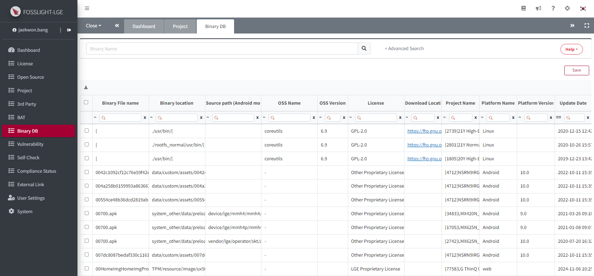

# Binary DB
Once a base model’s binary has been analyzed, its information can be saved in the Binary DB. This enables automatic analysis of similar binaries in other models.  
  

## How to Automate Binary Analysis
{: .left-bar-title }  
- After uploading the **binary analysis result (FOSSLight Report)** and clicking the Save button, the FOSSLight Hub compares it with the Binary DB and automatically fills in OSS Name, License, and other information for identical or similar binaries.  
    - Applicable menus 
        - **Project > Identification > [BIN](https://fosslight.org/hub-guide-en/tutorial/1_project/2_Identification/4_BIN_Tab.html), BIN(Android\|Yocto) tab** 
        - **3rd Party > Identification > 3rd party tab**
    - When using FOSSLight Binary Scanner version [above v4.1.30](https://github.com/fosslight/fosslight_binary_scanner/), TLSH and checksum values can be found in the Binary Sheet of the FOSSLight Report, so there is no need to attach the binary.txt file.    
 {: .styled-image}   

- Below the Binary Name field, a warning message will appear indicating whether the binary is identical or similar to a binary that exists in the Binary DB.    
    - For more details about the warning messages, refer to [OSS Table Warning Message](https://fosslight.org/hub-guide-en/tips/1_common/5_warning_message/#bin-binandroid-tab).
{: .styled-image}  
   

- **How to check for a match in Binary DB**
    - Whether a binary matches one in the Binary DB is determined using the following data.  
        1. If the binary name and checksum value match, it is considered identical.   
        2. Or, if the binary names are the same and the [TLSH (Trend Micro Locality Sensitive Hash)](https://github.com/trendmicro/tlsh) distance between the binaries is 120 or below, they are considered similar.   
   

## Data Insertion into Binary DB
{: .left-bar-title } 
- During the 'Confirm' step of the Identification in 3rd Party or Project, binary information listed in Identification > BIN, BIN(Android\|Yocto), or 3rd Party is inserted into the Binary DB.  

  

    
Details of Data Insertion

    <ul style="margin-top: 8px;">
      <li>If the <strong>OSS Name</strong> is empty, it is saved as a hyphen "-".</li>
      <li>If the <strong>TLSH</strong> value is empty, it is saved as 0.</li>
      <li>If the <strong>Binary Name</strong> includes <strong>Path</strong> information, only the file name is saved as the <strong>Binary Name</strong>, and the path is ignored.</li>
    </ul>
  

- This only works when a binary analysis result (binary.txt or result.txt) has been uploaded.  
(Applicable only for FOSSLight Binary Scanner version 4.1.30 or below)   
- If the binary is identical but the OSS information is different, the existing information is deleted and replaced with the new information.  
- If the binary is similar, the existing OSS information is retained, and the new OSS information is additionally updated.  

    

    
Detailed Behavior

    <table border="1" cellspacing="0" cellpadding="0" style="border-collapse: collapse; width: 100%; font-family: Arial, sans-serif;">
        <thead>
        <tr style="background-color: #f2f2f2;">
            <th style="padding: 10px;">No</th>
            <th style="padding: 10px;">Case</th>
            <th style="padding: 10px; width: 25%;">Action</th>
            <th style="padding: 10px;">Description</th>
        </tr>
        </thead>
        <tbody>
        <!-- No 1 -->
        <tr>
            <td style="padding: 10px; vertical-align: top; background-color: white;">1</td>
            <td style="padding: 10px; vertical-align: top; background-color: white;">If no binary with the same <strong>Binary Name</strong> exists in the <strong>Binary DB</strong></td>
            <td style="padding: 10px; background-color: white;">Save as new <strong>Binary</strong></td>
            <td style="padding: 10px; background-color: white;">The binary is saved as a new <strong>Binary</strong>.</td>
        </tr>
        <!-- No 2 -->
        <tr>
            <td rowspan="2" style="padding: 10px; vertical-align: top; background-color: white;">2</td>
            <td rowspan="2" style="padding: 10px; vertical-align: top; background-color: white;">If a <strong>Binary</strong> with the same <strong>Binary Name</strong> and identical <strong>checksum</strong> exists in the <strong>Binary DB</strong></td>
            <td style="padding: 10px; background-color: white;">Update with latest <strong>Binary</strong> information</td>
            <td style="padding: 10px; background-color: white;">Delete the existing <strong>Binary</strong> information in the <strong>Binary DB</strong> and save the latest <strong>Binary</strong> information.</td>
        </tr>
        <tr>
            <td style="padding: 10px; background-color: white;">If multiple <strong>OSS</strong> are used in a single <strong>Binary</strong></td>
            <td style="padding: 10px; background-color: white;">If multiple <strong>OSS</strong> are used in the same <strong>Binary</strong> within a single <strong>Project</strong>, all <strong>OSS</strong> information is saved.</td>
        </tr>
        <!-- No 3 -->
        <tr>
            <td rowspan="2" style="padding: 10px; vertical-align: top; background-color: white;">3</td>
            <td rowspan="2" style="padding: 10px; vertical-align: top; background-color: white;">If a <strong>Binary</strong> with the same <strong>Binary Name</strong> exists in the <strong>Binary DB</strong>, but the <strong>checksum</strong> does not match</td>
            <td style="padding: 10px; background-color: white;">
            If <strong>TLSH distance</strong> &lt;= 120, 
            the action depends on <strong>OSS</strong> information
            </td>
            <td style="padding: 10px; background-color: white;">
            <ol style="margin: 0; padding-left: 18px;">
                <li>If <strong>OSS Name</strong> and <strong>OSS Version</strong> are the same 
                ∘ Save as a new <strong>Binary</strong>. The existing <strong>Binary</strong> information can only be used when <strong>checksum</strong> matches, so set <strong>TLSH distance</strong> to 0.
                </li>
                <li>If <strong>OSS Name</strong> is the same but <strong>OSS Version</strong> is different 
                ∘ Save as a new <strong>Binary</strong>.
                </li>
                <li>If <strong>OSS Name</strong> is different 
                ∘ Save as a new <strong>Binary</strong>. The existing <strong>Binary</strong> information can only be used when <strong>checksum</strong> matches, so set <strong>TLSH distance</strong> to 0.
                </li>
            </ol>
            </td>
        </tr>
        <tr>
            <td style="padding: 10px; background-color: white;">If <strong>TLSH distance</strong> &gt; 120, save as new <strong>Binary</strong></td>
            <td style="padding: 10px; background-color: white;">If the <strong>TLSH distance</strong> is greater than 120, it is considered a different <strong>Binary</strong> and saved as a new one.</td>
        </tr>
        </tbody>
    </table>
    

   

## View Binary DB  
{: .left-bar-title } 
- You can view the current status of binaries registered in the Binary DB through the Binary DB menu.
{: .styled-image}    
