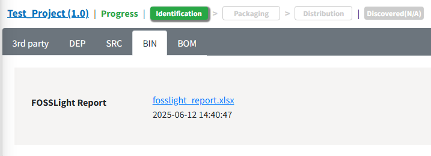
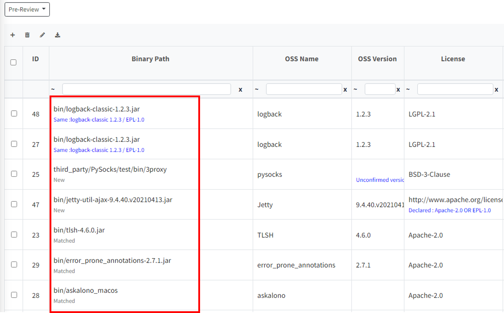

# Binary DB
```note
 You can store the binary information of the already analyzed Base Model in a databse(Binary DB) and use it to automate the binary analysis of derivative models.
```

## How to use DB
###  Automation of Binary Analysis

After uploading the binary analysis results of **Project > Identification > [BIN](https://fosslight.org/hub-guide-en/tutorial/1_project.html#2-4-bin-tab), BIN(Android|Yocto) tab** or **the 3rd Party Software(FOSSLight Report, binary.txt)** and clicking the Save button, FOSSLight Hub will automatically fill in the OSS Name, License, and other information by comparing it with the Binary DB for identical or similar binaries.
-  binary.txt: A binary list file that includes checksum and TLSH values.


<br>
```note
- When using [FOSSLight Binary Scanner v4.1.30 or later](https://github.com/fosslight/fosslight_binary_scanner/), you can check the TLSH and Checksum values in the Binary Sheet of the FOSSLight Report. (binary.txt file is no longer needed)
```

<br>
- Below the Binary Name, a warning message will display information on whether the binary is identical or similar to those in the Binary DB.


#### < Warning Message >

| Message | Description |
|---------|------|
|<span style="color:#0000FF">Same</span>| For identical binaries stored in the Binary DB, OSS information will be displayed, indicating that some information differs (e.g., License, OSS Name, etc.).|
|<span style="color:#0000FF">Similar</span>| For similar binaries stored in the Binary DB, OSS information will be displayed, indicating that some information differs (the TLSH distance value will be shown in parentheses).|
|Matched|The Binary Name, OSS Name, OSS Version, and License stored in the Binary DB match.|
|Modified| This is a case where the binary has the same name but low similarity (the TLSH distance value will be shown in parentheses).|
|New|There is no binary with the same name in the Binary DB. |


```note
Whether a binary matches those in the Binary DB is determined using the following two criteria:   
    1. If the binary name and checksum value match, it is considered identical.   
    2. Alternatively, if the binary name is the same and the TLSH distance between the two binaries is 120 or less, it is considered similar. 
```
