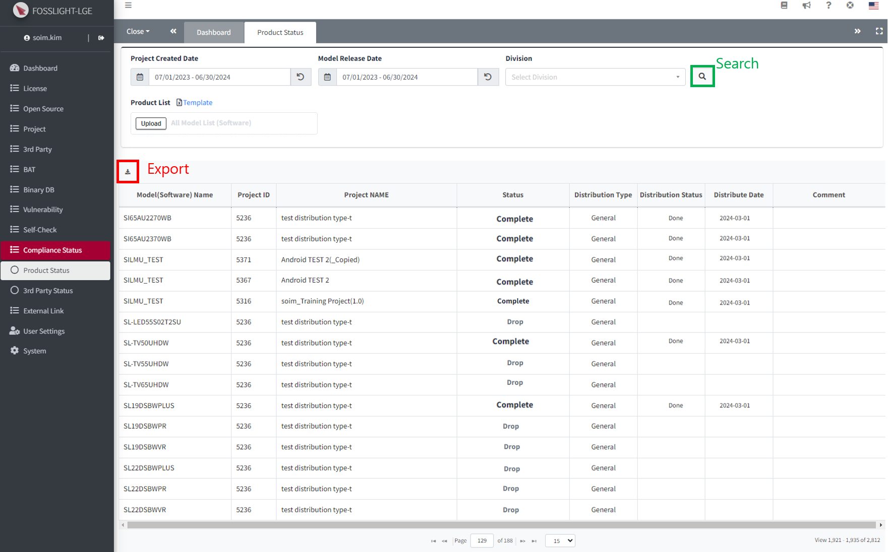

# (LGE Only) Compliance Status 
You can verify the status of Open Source Compliance implementation for distributed Software or Models.

## Product Status
{: .left-bar-title}
{: .styled-image} 
- You can search by Project creation date, Model release date, and Division. 
- (Optional) When you input and upload the Product List sheet > Product Name in the Product List Template, the Project or Model search results registered with the Product Name are added.
    - Product names that are not searched in FOSSLight Hub are searched in LG Open Source Site.
- Search results: Search results from FOSSLight Hub by Project creation date, Model release date, and Division.
    - However, if a Product List Template is attached, the results of finding the product name written in the file are added.
    - It is searched only when the Status is Complete or Drop.

## 3rd Party Satus 
{: .left-bar-title}
{: .styled-image} 
- 3You can search by 3rd Party creation date and Division.