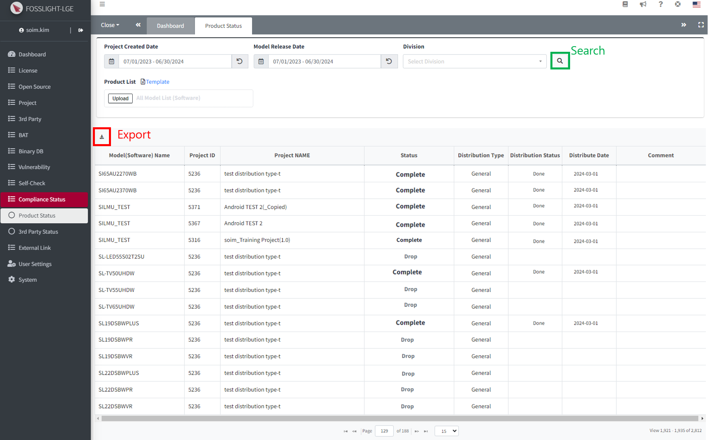

# (LGE Only) Compliance Status 
You can verify the status of Open Source Compliance for distributed Software or Model.

## Product Status
{: .left-bar-title}
{: .styled-image} 
- Search Options : You can search by Project Created Date, Model Release Date, and Division.  
- Search Results : The results are from FOSSLight Hub.  
    - When using a Product List Template  
        - Only the Product Names listed in the Product List sheet are used as the basis for the search. The system first queries FOSSLight Hub, and if no results are found, it checks the LG Open Source Site.  
-  Export : The search results can be downloaded as an Excel file.  
    - Result Display (when using a Product List Template)  
        - ‘Product OSC Status’ sheet: Displays results for the Product Names listed in the Product List.  
        - ‘Product OSC Status (ALL)’ sheet: Displays results for all Product Names available in FOSSLight Hub, in addition to those included in the uploaded file.  

## 3rd Party Satus 
{: .left-bar-title}
{: .styled-image} 
- You can search by 3rd Party creation date and Division.