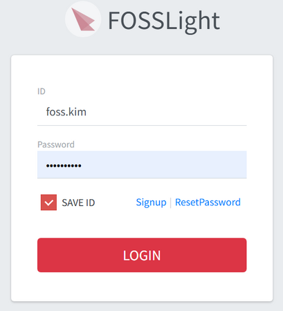
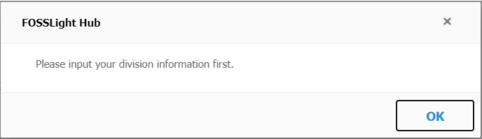
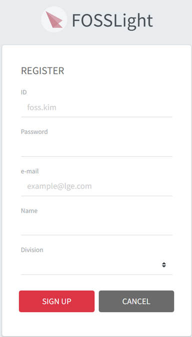

# Sign In & Sign Up
```note
How to sign in and register for an account with FOSSLight Hub.
```
## Sign In

-  When you login for the first time, click the "SignUp" button to register an account.

### (LGE Only)
- You can log in with your AD account. <U>(No need to sign up)</U>
- On the first login, a popup window will appear prompting you to enter Division information.
  
- When you click OK, you will be redirected to the User Setting screen where you can set your Division information.

## Sign Up 

- If this is your first time accessing FOSSLight Hub, register for an account.
