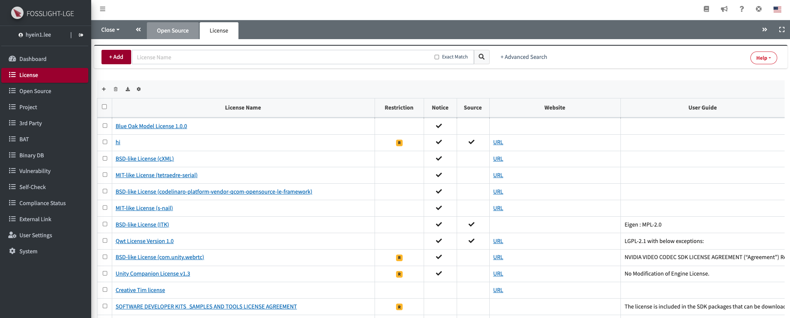

# License
```note
You can view registered license information and add, modify, or delete licenses.
You can check detailed information by clicking a cell in the License Name Column of the License List.
```
## License List


### License Name
- The License Full Name follows the SPDX notation (<https://spdx.org/licenses/>).
- If you click the value of the License Name column, you can check detailed information for each license.

### Identifier
- The standardized short identifier makes it easier to identify the License and follows the SPDX notation (<https://spdx.org/licenses/>).

### License Type
- **Permissive**
    - Known as BSD-like or BSD-style License, these licenses have minimal requirements for software distribution.
    - Typically, it is required to maintain the copyright notice and disclaimer.
- **Weak Copyleft**
    - You can freely distribute copies and modified versions of the work on the condition that the same rights are retained in the derivative work. 
    - The source code of the original work and modifications must be disclosed.
- **Copyleft**
    - You can freely distribute copies and modified versions of the work on the condition that the same rights are retained in the derivative work. 
    - Not only the source code of the original work and its modifications but also the source code of any linked or integrated programs must be disclosed.
- **Proprietary**
    - Since it cannot be used without the permission of the software right holder, be sure to check the contractual relationship with respect to the use of the source code before using it.
- **Proprietary Free**
    - No additional contract is required, but can be used in specific terms and conditions or restrictions.

### Restriction

|**Restriction Type**|**Description**|
|-----|---|
|**Non-Commercial Use Only**|Commercial use and distribution of software is prohibited. <br> ex) CC-BY-NC-X.X|
|**Network Redistribution**|Providing service over network is regarded as distribution, and the obligations of open source must be fulfilled. <br> ex) AGPL-3.0, OSL-2.0|
|**No Modification**|You cannot distribute a modified version of the software. In other words, it should be used without modifying the source code. <br> ex) CC-BY-ND-X.X|
|**Platform Limitation**|Software distribution is restricted based on the operating system, technology, technology field used, and device type. <br> ex) Amazon Software License (must be used for web services, computing platforms, or applications provided by Amazon.com or its subsidiaries)|
|**Prohibited Purpose**|Software cannot be used for a specific purpose(field). <br> ex) The Happy Bunny License (cannot be used for military purposes)|
|**Specification Constraints**|Software should be used in relation to a specific specification or standard. <br> ex) ETCPACK Software License Agreement (It can be used for compression and/or decompression according to the Khronos standard specifications) |
|**Redistribution Restriction**|Restricted software sub-components (Source Code, Binary file, etc.) that can be redistributed. <br> ex) SOFTWARE LICENSE FOR VIVANTE CORPORATION (TM) USER SPACE GRAPHICS DRIVER BINARY (can only be redistributed in binary form)|
|**Contract Required**|It cannot be used without a commercial contract. <br>ex) QT Commercial License, NVIDIA Commercial License|
|**Internal Use Only**|It allowed only for internal use. <br> ex) Additional-Buildcraft-Objects-Mod License|
|**No Charge**|It cannot be used if a fee is charged for the software. <br> ex) Commons Clause License Condition v1.0, SIL Open Font License 1.1|
|**No Change the Name**|This license does not allow to change name. <br> ex) IPA Font License|
|**Provide Installation Information Required**|It must provide installation information. <br> ex) GPL-3.0|
|**Patent Warning**|This license may be subject to patent disputes and should be used with caution. <br> ex) Apple Public Source License|
|**Semi-Copyleft**|This license has restrictions, but there are no problems with use if the source code is disclosed. <br> ex) Ruby License|
|**Contact Required**|This license must be checked by contacting the copyright holder.|
|**Unexpected Termination**|The license can be terminated at any time by the copyright holder.|
|**Use Restriction**|There are restrictions on use, such as the number of users, country of use, and others.|

### Obligation
You can find out the notice and source code disclosure obligations for each license.
- **Notice**: If the checkmark () is marked, it indicates an obligation to notify regarding copyright, license, or both.
- **Source**: If the checkmark () is marked, it indicates an obligation to disclose the source code.

### Web site
- Provides web site information of the original license. Click the URL to go to the site.

### User Guide
- You can see the precautions when using the license.

## (Admin Only) Add, Modify, Delete License
### Add

1. Click the Add button in the upper left of the License List.
2. At the "New_License" tab, enter the information of the new OSS.
    - **License Name** and **Nick Name** cannot be duplicated.
    - **Obligation** :
        - If Notice is checked, it is included in the OSS Notice.
        - If Source Code is checked, it is displayed as a list of source code collection OSS in the Packaging tab.
    - **User Guide** : Enter information about the OSS.
    - **Attribution** : When issuing an OSS Notice, enter the phrase that must be included separately.
3. Click the Save button() at the top right.

### Modify
1. In the License List, click the License Name to be modified.
2. Make modifications on the License Details tab.
3. Click the Save button at the top right.

### Delete
1. In the License List, click the license name you want to delete.
2. In the License Details tab, enter the reason for deletion in the Comment field.
3. Click the Delete button at the top right.
