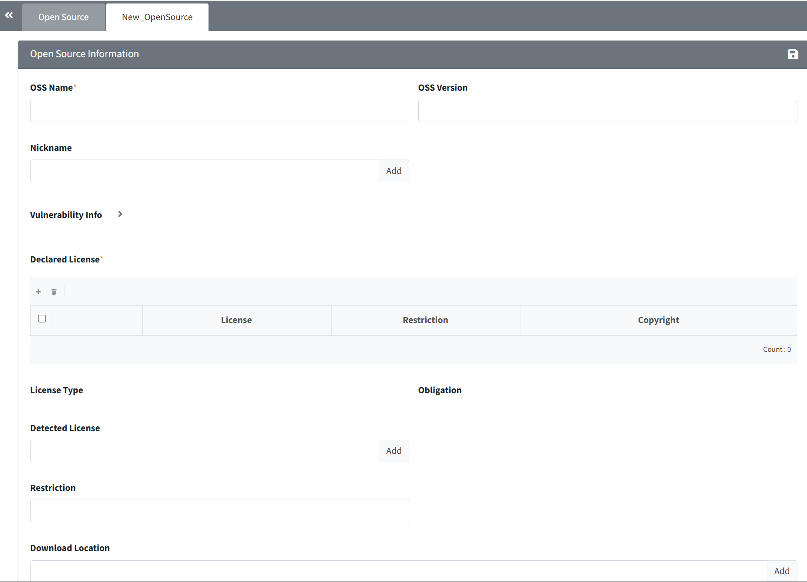
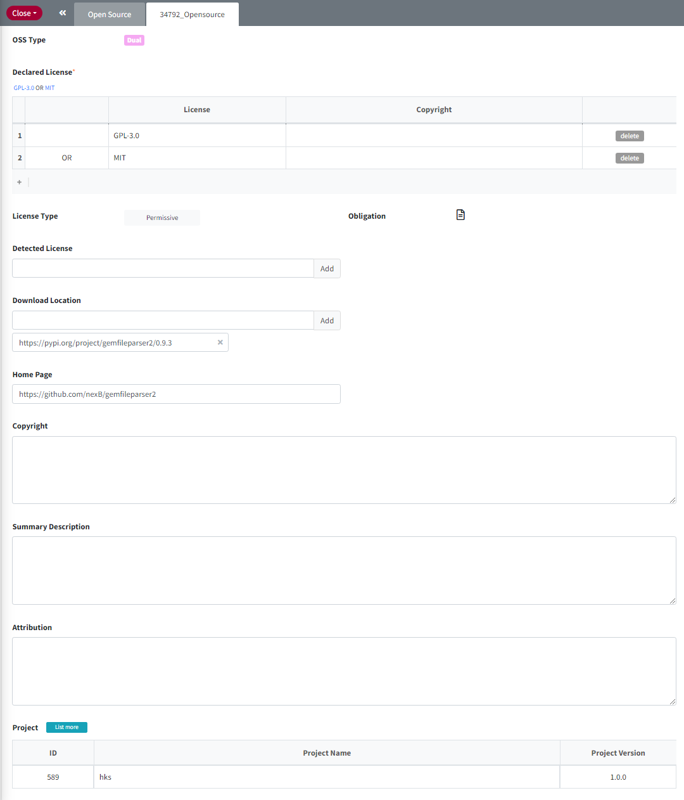

# Open Source
```note
You can view registered OSS (Open Source Software) information and add, modify, or delete OSS.
To see detailed information, click a cell in the OSS Name column of the OSS List. Deactivated Legacy OSS is displayed as a gray row.
```
## Open Source List


### ID
- A number that identifies Open Source.
- If multiple versions of Open Source are registered, '+' is displayed and the highest version is displayed. If you click the '+' button, you can see the other version of same Open Source 

### OSS Type
- **Multi**
    - The OSS contains source code of multiple licenses.
    - Only the licenses corresponding to the source code that you actually use for the project sholuld be included in the OSS report or Identification.
        - ex) OSS License : LGPL-2.1 <span style="color:red">AND</span> GPL-2.0 <span style="color:red">AND</span> Zlib <span style="color:red">AND</span> CUPS License Agreement
- **Dual**
    - You can choose one of multiple licenses.   
    - It is better to choose a license with relatively fewer obligations (refer to Obligation)
        - ex) OSS License : Apache-2.0 <span style="color:red">OR</span> LGPL-2.1
- **V-Diff**
    - As the license is different according to the version, license differs by oss versions.

### OSS Name
- The OSS marked with 'Nick' has multiple names.    
    Ex) Nick name of "bison" is "Bison parser" and "GNU bison" all expressing the same OSS.  
        If you add GNU bison (nick name) on Identification, it is automatically changed to bison(OSS name).  
- When searching, auto-completion is supported and a list of partially matching OSS names is displayed after inputting 3 characters. 
      
### Version
- It means the OSS version.

### License Name
- You can see the declared license of the OSS.
- Multi License is indicated with <span style="color:red">AND</span> for all licenses included in the OSS.
- Dual License allows you to choose from multiple licenses for the OSS and is indicated with <span style="color:red">OR</span>.
- When entering a keyword that matches the License Name or SPDX Identifier, it searches for all Open Source that includes it.


### License Type
- Please refer to the following page.
    - [License Type](https://fosslight.org/hub-guide/menu/2_license.html#license-type) 

### Obligation
You can find out the notice and source code disclosure obligations for each open source.
- **Notice**: If the checkmark () is marked, it indicates an obligation to notify regarding copyright, license, or both.
- **Source**: If the checkmark () is marked, it indicates an obligation to disclose the source code.

### Download Location
- The URL is displayed as a link. You can go to the site or download Open Source by clicking on it.

### Homepage
- If an official Open Source site exists, it is displayed as a URL, and clicking on it will take you to the respective site.
- When you hover over the URL with your mouse, you can see the detailed address.

### Description
- You can check the precautions when using the Open Source.

### Vulnerability
- When the OSS is found in the NVD database, it is displayed with the colored Vulnerability icon according to the severity of the vulnerability(CVE score).


## (Admin Only) Add, Modify, Delete, Copy, Sync OSS 
### Add
 
1. Click the **Add** button in the upper left of the OSS List.
2. In the "New_Opensource" tab, enter the information of the new OSS.
    - OSS Name and Nick Name cannot be duplicated.
    - Summary Description : Fill in information about the OSS.
    - Attribution : Fill in the phrase that must be included in issued OSS Notice.
3. Click the **Save** button at the upper right.

### OSS Details tab
Click the OSS Name in the OSS List.    
The Editable option and the Save, Sync, Copy, and Delete buttons are displayed only if you are an Admin.  
 

#### OSS Modify
- Modify the information in the OSS Details tab and Click the **Save** button at the upper right.

#### OSS Copy
The OSS copy function is useful when adding different versions of the same OSS.
1. Click the **Copy** button at the upper right.
2. The "New_Opensource" tab appears with the same OSS information.
3. At this time, "_Copied" is appended to the OSS Name.
4. After editing the information, click the **Save** button at the upper right to register OSS.

#### OSS Delete
1. In the OSS Details tab, fill in the reason for deletion in the Comment column.
2. Click the **Delete** button at the upper right.
    - 📢 If the relevant OSS is included in the project where the identification step is confirmed, a window for selecting another OSS to be merged will pop up when clicking the Delete button.
    
        - If you select the OSS to be merged, name and nicknames of the OSS to be deleted will be add as nicknames of the OSS to be merged. 


#### Update information for each OSS version at once
If multiple versions are registered in OSS, information for each version is updated at once.
Click the **Sync** button at the upper right.
  
- (1) Select the OSS version to be modified.
     - Versions that already have the same OSS information are grayed out and cannot be selected.
- (2) Select the OSS information to be modified. Information is updated only for checked items.
     - The information displayed is the OSS information of the corresponding version of the row selected in (1).
- (3) Comment field.
     - When you click OK, the comment entered in the OSS version to be modified selected in (1) is added.


