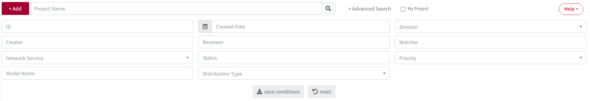

# Project

The process required for the development and distribution of software that includes open source software is carried out sequentially. 
For detailed information, please refer to the <a href="https://fosslight.org/hub-guide-en/tutorial/1_project"><strong>Project tutorial.</strong></a> 
    1. <a href="https://fosslight.org/hub-guide-en/tutorial/1_project/2_Identification"><strong>Identification</strong></a> : Open Source analysis results (FOSSLight Report) are prepared and submitted for review to the OSPO. 
    2. <a href="https://fosslight.org/hub-guide-en/tutorial/1_project/3_packaging"><strong>Packaging</strong></a> : Collect the source code to be disclosed(OSS Package). 
    3. <a href="https://fosslight.org/hub-guide/tutorial/1_project/4_distribution"><strong>Distribution</strong></a> : The OSS Notice and OSS Package are registered on the distribution site.

<iframe width="560" height="315" src="https://www.youtube.com/embed/IUrQyj3s-Ps" title="FOSSLight Hub - 프로젝트 생성" frameborder="0" allow="accelerometer; autoplay; clipboard-write; encrypted-media; gyroscope; picture-in-picture" allowfullscreen></iframe>

## Project List
{: .left-bar-title }
You can search for a project, check the overall information of the project, and download the FOSSLight Report, OSS Notice, and OSS Package.
{: .styled-image}  

### 1. Project Search
{: .specific-title}  
- You can search by the project's name. With **Advanced Search** feature, you can search using various conditions.
    - Advanced Search
        - You can search under various conditions such as ID, Creator, Model Name, etc.
     {: .styled-image}

### 2. Project ID
{: .specific-title}  
- It is a unique number that identifies the project.

### 3. Projcet Name (Version)
{: .specific-title}  
- Double-clicking a row takes you to the project detail screen.

### 4. Status
{: .specific-title}  
- It displays the status information of the project.

|Status|   Description   |
|----|----|
| Progress | The user is currently writing.|
| Request | The user has requested a review in the Identification or Packaging stage.  The status can be changed to Progress using Self Reject.|
| Review | The reviewer is currently reviewing in the Identification or Packaging stage.  The user cannot modify the project information.  If modifications are needed, please leave a [Comment](#comment) for the reviewer to request a reject.|
| Final Review | The OSPO manager is conducting the final review.|
| Complete | It means the project review is complete.  The user cannot modify the project information.  If modifications are needed, please request a reopen from the reviewer.|
| Drop | It means the OSC process is no longer being carried out.   If it is not in the Complete status, the user can drop it regardless of the status,  and if necessary, they can click Reopen to open it again.|

### 5. OSC Process
{: .specific-title}  
- It indicates the progress stage of the project's OSC process.
    - Identification -> Packaging -> Distribution
- The color of the process stage changes based on the status.

### 6. Download
{: .specific-title}  
- (): You can download the list entered in Identification in the **FOSSLight Report**.  
- (): You can download a **Review Report** from the Identification SBOM list when risks or important notes are detected in Open Source, License, or vulnerability reviews.      
- (): When the Packaging stage is completed, an icon will be displayed, and you can download **the OSS Notice**.  
- (): If the source code to be released is uploaded in Packaging, an icon will be displayed, and you can download **the OSS Package file**.  

### 7. Security
{: .specific-title}  
It displays the Vulnerability information for the entire open source list included in the Identification stage (except the ones that 'Exclude' is checked).  
- () : If the vulnerability score is above the threshold.  
- () : If the vulnerability score is below the threshold.  
