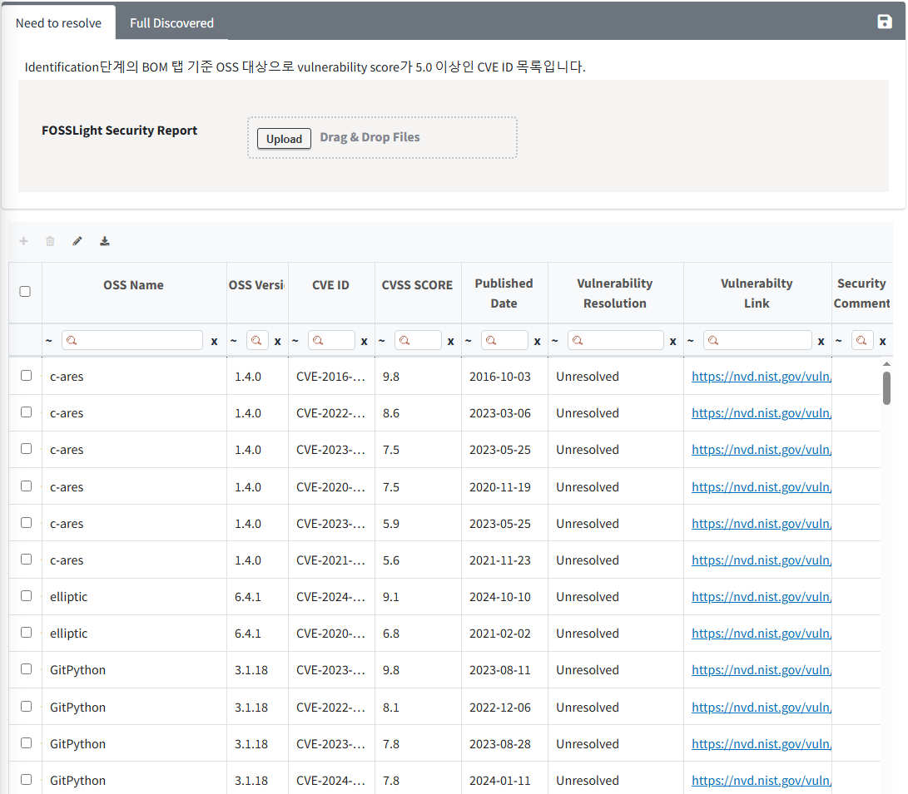
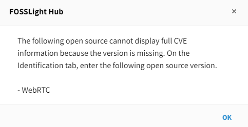

# Project
```note
The process that must be performed for the development and distribution of software including open source software is performed sequentially.

```

## Project List
**You can search for a project, check the overall information of the project, and download the FOSSLight Report, OSS Notice, and OSS Package.**
 

### 1. Project Search
- You can search by the project's name. Using the **Advanced Search** feature, you can search under various conditions.
    - Advanced Search
        - You can search under various conditions such as ID, Creator, Model Name, etc.

### 2. Project ID
- It is a unique number that identifies the project.

### 3. Projcet Name (Version)
- Double-clicking a row moves to the project detail screen.

### 4. Status
- It displays the status information of the project.

|Status|   Description   |
|----|----|
|<span style="color:green"> Progress </span>| The user is currently writing.|
|<span style="color:pink"> Request </span>| The user has requested a review in the Identification or Packaging stage. <br>The status can be changed to Progress through Self Reject.|
|<span style="color:orange"> Review </span>| The reviewer is currently reviewing in the Identification or Packaging stage. <br>The user cannot modify the project information. <br>If modifications are needed, please leave a [Comment](#comment) for the reviewer to request a reject.|
|<span style="color:purple"> Final Review </span>| The OSPO manager is conducting the final review.|
|<span style="color:black"> Complete </span>| It means the project review is complete. <br>The user cannot modify the project information.<br> If modifications are needed, please request a reopen from the reviewer.|
|<span style="color:grey"> Drop </span>| It means the OSC process is no longer being carried out. <br> If it is not in the Complete status, the user can drop it regardless of the status, <br>and if necessary, they can click Reopen to open it again.|


### 5. OSC Process
- It indicates the progress stage of the project's OSC process.
    - Identification -> Packaging -> Distribution
- The color of the process stage changes according to the status.


### 6. Download
- (): You can download the list entered in Identification as a **FOSSLight Report**.
- (): If the source code to be released is uploaded in Packaging, an icon will be displayed, and you can download **the OSS Package file**.
- (): When the Packaging stage is completed, an icon will be displayed, and you can download **the OSS Notice**.


### 7. Security
```note
In the Security tab, you can check and manage the status of actions for each CVE ID for OSS with a vulnerability score above the threshold based on the BOM tab in the Identification stage.
- The threshold for the Vulnerability Score can be set in Code Management > 760 (Security Vulnerability Score).
```

- It displays the Vulnerability information for the entire open source list included in the Identification stage (excluding 'Exclude' checked).
    - () : If the vulnerability score is above the threshold
    - () : If the vulnerability score is below the threshold


#### Column 정보
- **OSS Name, OSS version**
    - The OSS information entered in the BOM tab of the Identification stage is automatically displayed.
- **CVE ID, CVSS Score, Published Date**
    - The CVE ID and the corresponding CVE ID's CVSS Score and published date information are automatically displayed.
- **Vulnerability Resolution**
    - The default value is set to Unresolved, and it can be changed to Fixed when the security vulnerability is resolved.

#### If OSS version is not entered
- In the Security tab, it is difficult to accurately verify vulnerabilities for CVE IDs without an OSS version, so the entire list of CVE IDs is not displayed.
- If the following popup screen appears when entering the tab, you can check the accurate list of security vulnerability CVE IDs in the Security tab after entering the correct version of the corresponding open source in the Identification tab and saving the BOM tab.    


#### Reflecting Vulnerability Resolution in the Identification Stage
- When checking the vulnerability score in the Identification stage tab, you can see the excluded max score for CVE IDs whose vulnerability resolution value has been changed to 'Fixed' in the Security tab.
- When clicking the Vulnerability Icon in the Identification stage tab, you can see that the 'Fixed' CVE IDs are deactivated in the entire CVE ID list window for the corresponding OSS name and version, as shown below.

<br>
