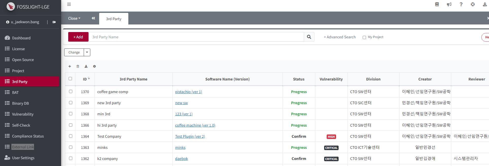
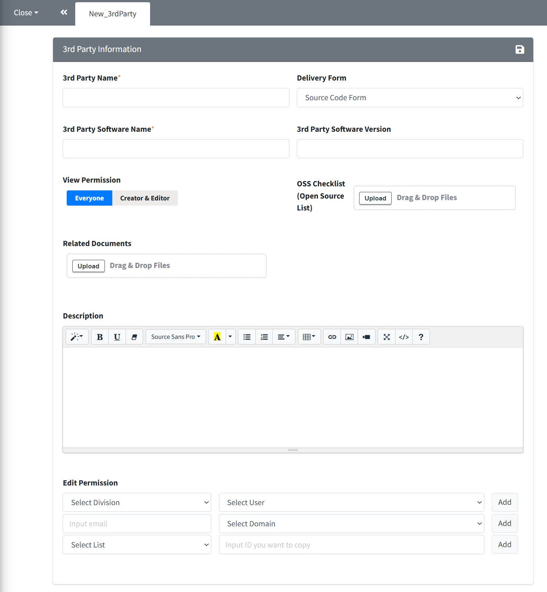
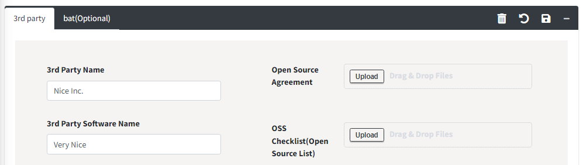
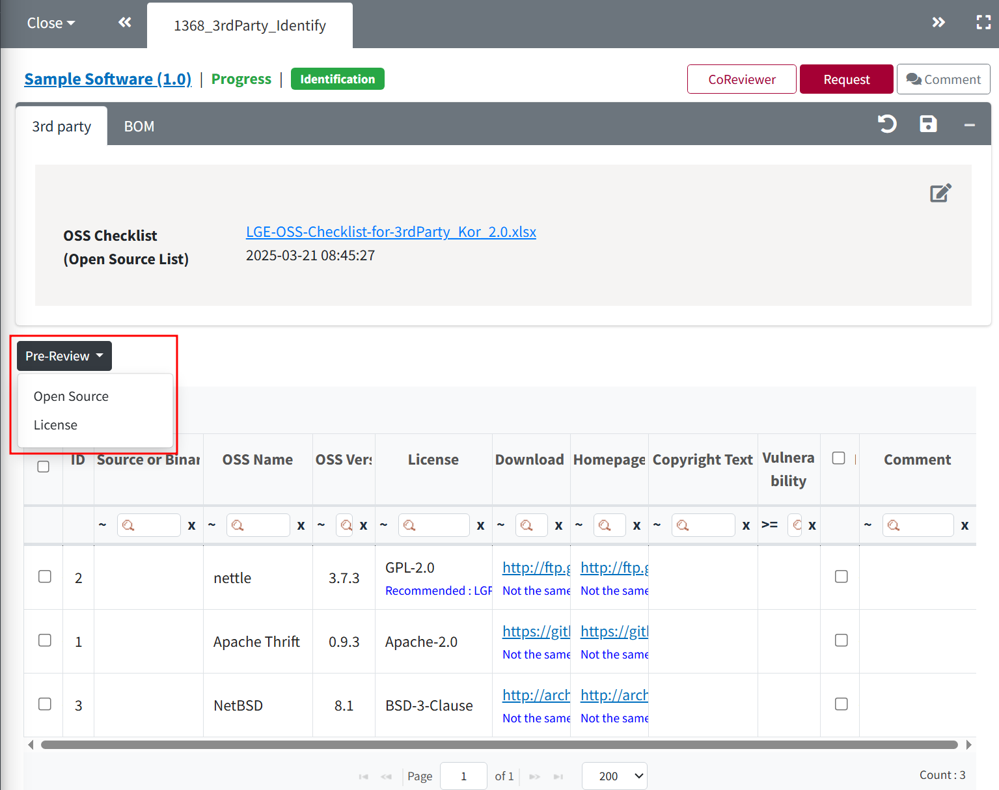
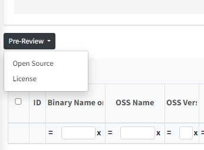
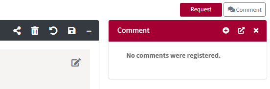

# 3rd Party
```note
- Request the 3rd party to complete and submit the 3rd Party OSS Checklist, and register and manage the open source information of the received software.
- Status : Only the 3rd party, which is Confirm, can be loaded from the Project > Identification - 3rd Party tab.
```
<iframe width="560" height="315" src="https://www.youtube.com/embed/IIOsmWupkn4" title="FOSSLight Hub - 3rd Party SW 등록" frameborder="0" allow="accelerometer; autoplay; clipboard-write; encrypted-media; gyroscope; picture-in-picture" allowfullscreen></iframe>

## 3rd Party Software Registration Process
### 1. Preparatory Steps
- **Open Source Software List**
    - Request and collect the 3rd Party OSS Checklist from the third party.

### 2. 3rd Party SW Registration

1. Click on '3rd Party' in the left menu.
2. Click the **Add** button at the top left of the 3rd Party List page.
3. In the "New_3rdParty" tab, enter the 3rd party information and click Save.
    
4. Input all necessary details and upload the prepared **3rd Party OSS Checklist** file.


#### Description of Each Field

|Field | Description |
|:---|:---|
|**3rd Party Name**|Enter the 3rd Party Name.|
|**Software Name**|Enter the name of the software received from the 3rd party.|
|**Software Version**|Enter the version of the software received from the 3rd party.<br>(Identical versions for the same software cannot be duplicated.)|
|**Delivery Form**|Select the form of the received software. (Source Code Form, Binary Form)|
|**Permission**|Everyone: All users can view the information of the 3rd Party SW. <br>Creator/Watcher: Only the Watcher and Creator can view the 3rd Party SW; others cannot.|
|**Description**|(Optional) If there is any additional information for Open Source Compliance, please write it.|
|**Open Source Agreement**|(Optional) Attach only if you want to manage the contract at FOSSLight Hub.|
|**OSS Checklist (Open Source List)**| Upload the pre-prepared 3rd Party OSS Checklist. (When uploading, select 'Open Source Software List' as the sheet to apply.)|
|**fosslight_binary.txt**| (will be removed) Upload the fosslight_binary.txt file generated from the binary analysis results.|
|**Related Documents**|(Optional) Upload the relevant documents provided by the 3rd Party.|
|**Watcher**|Register the users with whom you want to share the information and status of the 3rd Party SW registration.|

### 3. Request
1. After entering the 3rd Party SW information, click the **Save** button().
    

2. After saving, click on the each Software name to enter the software.
    

3. For the loaded OSS, proceed with the **Pre-Review** on the middle left side. (Both Open Source and License)
    

4. If there are any changes, click the Save button() once more.

5. Click the **Request** button at the top right to request a review.
    

## Notes
### Create Project for OSS Notice
If the software being distributed is composed solely of 3rd Party Software, you can directly create a **Project > Project** (<U>Identification Confirmed status</U>) from the confirmed 3rd Party Software. However, if identification confirmation is not possible, a project in the identification request status will be created.

## (Admin Only) 3rd Party Review
1. Double-click the 3rd Party with Status : Request in the 3rd Party List.
2. Click the **Review Start** button at the top right.
    - The status will change to Review.
3. Review the red warning messages in the OSS table.
    - If there are red warning messages in the OSS table, confirmation is not possible.
    - To register as a new OSS, double-click the row to open a new OSS registration popup with the information from that row.
4. Once the review is complete, click the Confirm button.
    - If you need to request confirmation from the user again, click the Reject button.
