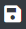

# Self-Check
```note
In Self-Check, you can easily check information such as licenses and vulnerabilities for the OSS(Open Source Software) to be reviewed without going through the review process.
```
<iframe width="560" height="315" src="https://www.youtube.com/embed/ihldFWFIbrM" title="YouTube video player" frameborder="0" allow="accelerometer; autoplay; clipboard-write; encrypted-media; gyroscope; picture-in-picture" allowfullscreen></iframe>

## Information available can be checked through Self-Check

You can view the following information by creating a Self-Check Project and entering the OSS to be reviewed.
- **OSS Detailed Information**: Registered version, license by version, copyright, homepage, download location, etc.
- **License Detailed Information**: Type of license, obligations, restrictions, full text of the license, etc.
- **User Guide**: Precautions when using the OSS, etc.
- **Vulnerability**: Security vulnerability information provided by NVD (National Vulnerability Database)

## Procedure for using Self-Check
Self-Check can be done through the following procedure.

### 1. Self-Check Project creation
1. Click the Add button at the top right of the Self-Check List.
2. Enter the relevant information and click Save.
3. You can view the newly created Self-Check Project in the Self-Check List, and double-click the list to check the details.
<br>

### 2. OSS information input
#### Entering OSS information on OSS Table
Click the + button to add a row, enter the OSS you want to check, and save.
#### Loading OSS information from FOSSLight Report file
- Upload the FOSSLight Report containing the OSS list in the Upload Analysis Result column.
  Uploadable FOSSLight Report form can be downloaded by clicking the Export button.
    
- Select the sheet to be loaded and click OK.  
    
- Click the Save button().
 

####  (LGE Only) Loading the FOSSLight Scanner Service analysis results by entering the URL.
**FOSSLight Hub's Self-check is integrated with [FOSSLight Scanner Service](http://fs.lge.com/).**
- Create a Self-check project.
- Select URL and enter the source link to be analyzed (a link that can be downloaded using wget or git clone) and click Send button.
    

-  You can see that the project has been created on [FOSSLight Scanner Service](http://fs.lge.com/).
    

<br>

### 3. Check OSS and License information

#### Warning Messages

| Message                 | Meaning |
|-------------------------|-----|
| Unconfirmed open source | Displayed when the OSS Name is not registered in FOSSLight Hub. | 
| Unconfirmed version | Displayed when the OSS Name is registered in FOSSLight Hub, but the same version is not registered. |
| This field is required | Displayed when the License information is not entered.     <br>(This is not a mandatory field in Self-Check.) | 
| Non-included license | Displayed when the OSS Name and OSS Version are registered in FOSSLight Hub, but the registered License is different. |

#### OSS and License information
Clicking the icon in the column below provides detailed information about the registered OSS, the License, and a guide for the License. However, even for registered OSS, a User Guide may not always be provided.
- **OSS Detail**: Detailed information such as various versions of the registered OSS, each License, and Copyright is provided in a popup window.
- **License Detail**: Detailed information about the License used by the OSS and the License Text are provided in a popup window.
- **User Guide**: Links to information that can be referenced when using the License are provided.

#### Obligations/restrictions according to the use of OSS
❕ Details can be checked in the [**License List**](2_license.md).
- **Obligation > Notify icon**(): Indicates an obligation to notify regarding copyright, license, or both.
- **Obligation > Source icon**():  Indicates an obligation to disclose the source code.
- **Restriction icon**: Indicates there are restrictions on using the OSS.  
(E.g., restrictions on modification, restrictions on commercial use, etc.)

### 4. Check Vulnerability information
```note
- Icon in the Vulnerability column : When the OSS is searched in the CVE DB provided by NIST, the Vulnerability icon is displayed in color according to the CVSS Score.
- Vulnerability information in an export file(.xlsx) : An Excel file containing a list of all described OSS and vulnerability information is downloaded.
- Detailed information related to Vulnerability can be found in [Vulnerability](7_vulnerability.md).
```

#### 1. Checking in FOSSLight Hub UI

When you click the Vulnerability icon, the vulnerability information of the corresponding OSS Name and OSS Version is provided in a pop-up window.

#### 2. Checking with an export file
- **Self-Check Sheet**
       
    The OSS list entered by the user is formatted according to the FOSSLight Report form.  
    The information in this tab can be used later in Identification of [Project](4_project.md).
- **Vulnerability Sheet**
      
    The entered version and higher version information of the OSS where vulnerability information was found are provided.  
    By clicking the Vulnerability Link, you can check the CVE-ID of the OSS Name and OSS Version. 
