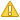

# Vulnerability
You can check whether there are any vulnerabilities in Open Source and check related information (CVE ID, CVSS Score).

## Vulnerability YouTube Guide
{: .left-bar-title}  
<iframe width="560" height="315" src="https://www.youtube.com/embed/_DzYYXM_iyQ" title="Vulnerability - Check Latest Security Vulnerabilities" frameborder="0" allow="accelerometer; autoplay; clipboard-write; encrypted-media; gyroscope; picture-in-picture" allowfullscreen></iframe>
   

## Vulnerability List  
{: .left-bar-title} 
- You can check and search for the highest security vulnerability information by version of open source provided in the **[NVD (National Vulnerability Database)](https://nvd.nist.gov/)**'s NVD Data Feeds.  
{: .styled-image}   

### 1. Search Conditions  
{: .specific-title}   
You can search by setting **OSS Name, OSS Version, CVE ID**, etc.
- OSS Name and OSS Version are not related to the OSS registered in the OSS List; they refer to the NVD Data Feeds Product Name and Version.
- When "Exact match" is checked, only results that exactly match the OSS Name will be displayed.
- For CVE ID, only exact matches will be displayed.

### 2. Search Results
{: .specific-title}  
- **Clicking the OSS Name link**: All CVE results for the OSS Name and nickname in that row by version will be displayed in a popup.
    - Exact match results for OSS Name, nickname, and version.
    - However, if the version is '-', all versions will be displayed.
- **Clicking the Nickname link**: All CVE results for the specific version based only on the nickname will be displayed in a popup.
    - Exact match results for nickname and version.
    - However, if the version is '-', all versions will be displayed.
- **Max CVSS Score**: The highest critical level for each version of the OSS is displayed.    

  <table border="1" cellspacing="0" cellpadding="8" style="border-collapse: collapse;">
    <thead>
      <tr>
        <th>Severity</th>
        <th>CVSS Score Range</th>
      </tr>
    </thead>
    <tbody>
      <tr>
        <td style="color:black; font-weight: bold;">
          
          Critical
        </td>
        <td style="padding-left: 20px;">9.0 ~ 10.0</td>
      </tr>
      <tr>
        <td style="color:red; font-weight: bold;">
          
          High
        </td>
        <td style="padding-left: 20px;">7.0 ~ 8.9</td>
      </tr>
      <tr>
        <td style="color:orange; font-weight: bold;">
          
          Medium
        </td>
        <td style="padding-left: 20px;">4.0 ~ 6.9</td>
      </tr>
      <tr>
        <td style="color:gold; font-weight: bold;">
          
          Low
        </td>
        <td style="padding-left: 20px;">0.1 ~ 3.9</td>
      </tr>
    </tbody>
  </table>

### Export Vulnerability Information
{: .specific-title}
- After checking the vulnerability information, you can download it as an Excel file by clicking the Export button on the left.   
{: .styled-image}
 

- **View Exported Information**  
{: .styled-image}
  - **OSS Name**: The OSS Name listed in the OSS Table
  - **OSS Version**: The version where the vulnerability was found
      - If the OSS version is blank, all versions related to the vulnerability will be displayed.
      - If a specific version is set, lower versions will not be included in the CSV (all higher versions will be included).
  - **CVE ID**: Security vulnerability ID provided by NVD (National Vulnerability Database)  
  - **CVSS Score**: The **Max Score** of the vulnerability for the OSS and version  
  - **Description**: Extra information for the OSS  
  - **Published Date**: The date the vulnerability was published by NVD  
  - **Last Revised**: The date the information on the security vulnerability was last revised by NVD   
  - **Vendor**: OSS Vendor (used to distinguish the vendor of the OSS when the OSS Name is the same)  

   

## Vulnerability Details
{: .left-bar-title}  
- After searching  in the Vulnerability List and click on the link for the OSS Name or Nickname, you can see the detailed screen.   
{: .styled-image}    
