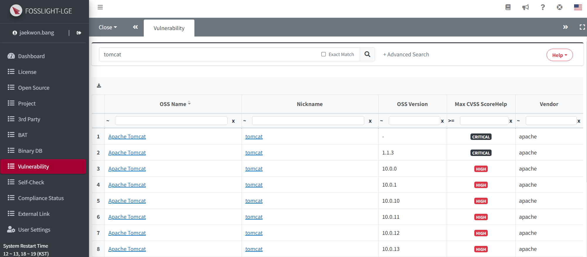
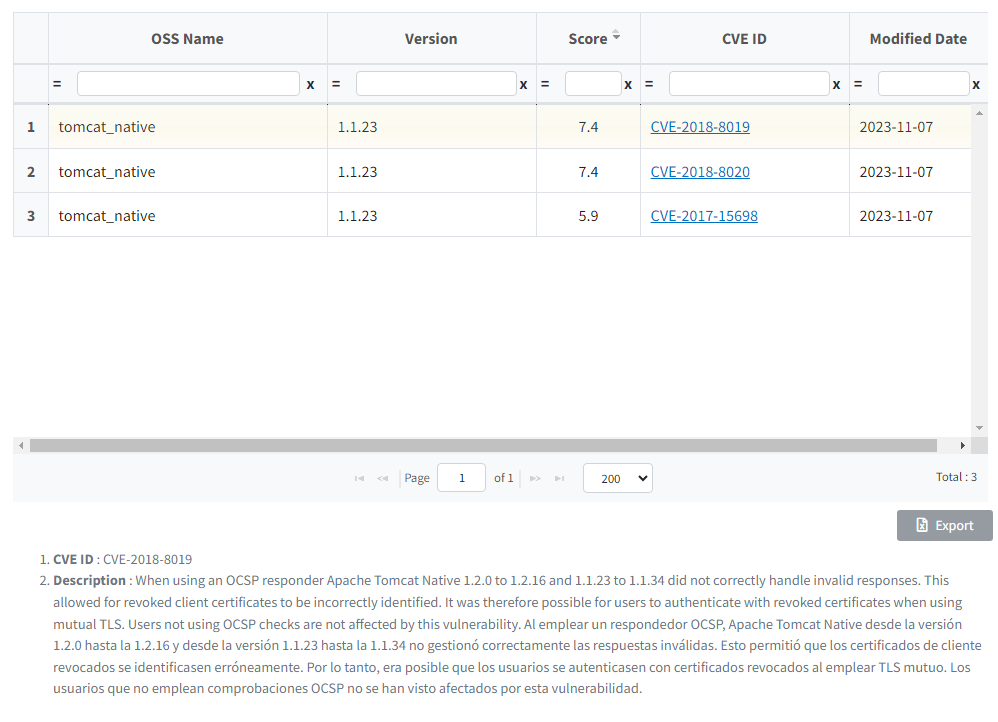
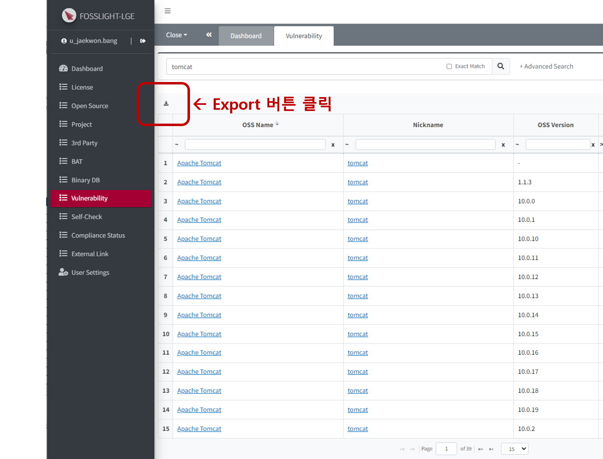
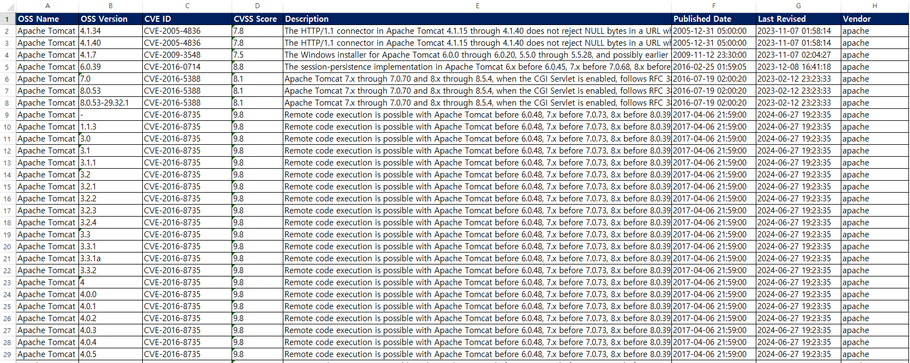

# Vulnerability
```note
You can check for the vulnerabilities in Open Source and related information (CVE ID, CVSS Score).
```

## Vulnerability List

You can check and search for the highest security vulnerabilities by version of open source provided in the NVD Data Feeds from the **[NVD(National Vulnerability Database)](https://nvd.nist.gov/)**.

### 1. Search Conditions
You can set **OSS Name, OSS Version, CVE ID, etc.,** to perform a search.
- OSS Name and OSS Version are not related to the OSS registered in the OSS List; they refer to the NVD Data Feeds Product Name and Version.
- When you check the 'Exact match' option and perform a search, only exact match results in the OSS Name field will be displayed.
- For CVE ID, only results that exactly match will be displayed.

### 2. Search Results
- **When clicking the OSS Name link**: All CVE results for the specific version of the OSS Name and nickname in that row will be displayed in a popup.
    - Exact match search results for OSS Name, nickname, and version.
    - However, if the version is '-', all versions will be displayed.
- **When clicking the Nickname link**: All CVE results for the specific version queried by nickname will be displayed in a popup.
    - Exact match search results for nickname and version.
    - However, if the version is '-', all versions will be displayed.
- **Max CVSS Score**: The highest critical level for each version of the OSS is displayed.

    |Critical Level|Critical Score|
    |:---:|:---:|
    |Critical    |9.0 ~ 10.0|
    |High        |7.0 ~ 8.9 |
    |Medium      |4.0 ~ 6.9 |
    |Low         |0.1 ~ 3.9 |

## Vulnerability details
### Detailed information popup
After searching in the Vulnerability List, click the link for OSS Name or Nickname.


### Exporting vulnerability information
- You can check the Max Score for each version of the OSS and subsequent versions corresponding to the OSS you entered.
- By clicking the Vulnerability link, a popup with detailed information will be displayed.
- After viewing the Vulnerability information, you can click the Export button on the left to download it as an Excel file.


#### Exported vulnerability information

- **OSS Name**: OSS Name listed in the OSS table
- **OSS Version**: Version in which the vulnerability was found
    - If the OSS version is blank, information for all versions present in the vulnerability will be displayed.
    - If the OSS Version is set, lower versions will not be included in the CSV (all higher versions will be included).
- **CVE ID**: Security vulnerability information ID provided by NVD(National Vulnerability Database)
- **CVSS Score**: **The Max Score** for the vulnerability of the OSS and version
- **Description**: Extra information for the OSS
- **Published Date**: The date the security vulnerability was published by NVD
- **Last Revised**: The date the information on the security vulnerability was last revised by NVD
- **Vendor**: OSS Vendor(an item to distinguish the vendor of the OSS when the OSS Name is the same)
