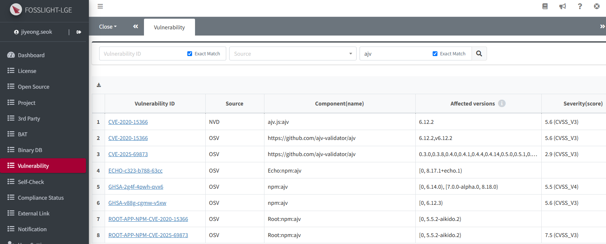

# Vulnerability
You can check the security vulnerability information of Open Source.

## Vulnerability List  
{: .left-bar-title} 
- You can check and search for the security vulnerability information of Open Source provided by **[NVD (National Vulnerability Database)](https://nvd.nist.gov/)** and **[OSV](https://osv.dev/)**.  
{: .styled-image}  

### 1. Search Conditions  
{: .specific-title}   
  - **Vulnerability ID** : You can search by setting the security vulnerability ID (Ex, CVE-XXXX-XXXXX, GHSA-XXXX-XXXX-XXXX) provided by NVD or OSV.
    - **When "Exact match" is checked**, only results that exactly match the search term will be displayed.
  - **Source** : You can select NVD or OSV to search the desired security vulnerability database.
  - **Component (Name)** : You can search by the name (package name) or GitHub address of the Open Source. 
    - **When "Exact match" is checked**, for NVD, only results that exactly match the CPE product value will be displayed, and for OSV, only results where the name or GitHub address exactly matches the repository name will be displayed.

### 2. Search Results
{: .specific-title}  
- **Vulnerability ID** : The security vulnerability ID (Ex, CVE-XXXX-XXXXX, GHSA-XXXX-XXXX-XXXX) provided by NVD or OSV is displayed.
- **Source** : The database that provided the vulnerability information is displayed.
- **Component (name)** : For NVD, the CPE vendor:product value (Ex, ajv.js:ajv) is displayed, and for OSV, the ecosystem:package name (Ex, npm:ajv) or GitHub repository (Ex, https://github.com/ajv-validator/ajv) address is displayed.
- **Affected versions** : The list of versions that fall within the scope of the vulnerability is displayed. Here, '[' means that the version is included, and '(' means that the version is excluded.
  - Ex) [0, 1.2.0): means that versions starting from 0 and lower than 1.2.0 are affected.
- **Severity(score)** : The severity of the vulnerability is displayed as a CVSS Score or in the format provided by the security vulnerability database.

### 3. Export Vulnerability Information  
{: .specific-title}
- After checking the vulnerability information, you can download it as an Excel file by clicking the Export button on the left.  
{: .styled-image}
