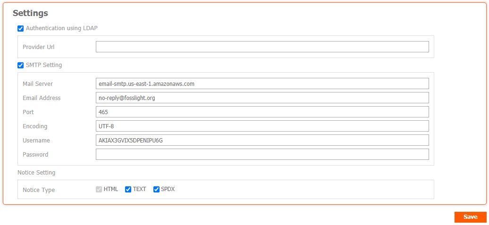

# System
```note
(Admin Only) Check the FOSSLight Hub log or change the operation data.
```

## Code Management

- Set the setting value to be loaded during system operation.

## User Management

Check the list of registered accounts and correct the information.
- Create button : Creates a Token to be used in [Rest API](../features/2_rest_api.md).
- Reset button : Resets the password to the same ID as the ID.
- Use YN : Set up dormant account.
- Admin : Admin authority is granted.

## History List

Check the data changes in the DB.

## Notification
Manage notification pop-ups to be displayed when accessing the system.
### 
Check and modify the list of registered notices.

### 
Click the + button at the bottom left of the list to add a notice.
- Start Date : Notification start date
- End Date : Notification end date
- Publish : If checked, a notification pop-up is displayed.

## Sent Mail List

Check the mail delivery history.

## Vulnerability Log

Check for Vulnerability Data changes.


## Configuration
```note
(Admin Only) Change the setting values ​​for FOSSLight Hub.
```


### Authentication using LDAP
FOSSLight Hub uses JNDI to support user password authentication using LDAP in an environment where LDAP such as Active Directory can be used.
- Provider Url : Set the LDAP server information in the format ldap://&lt;AD_SERVER_IP&gt;:&lt;LDAP_PORT&gt;. (javax.naming.Context.PROVIDER_URL)

### SMTP Setting

- Mail Server : SMTP Host (e.g. smtp.gmail.com)
- Email Address : Sender email address (e.g. no-reply@fosslight.org)
- Port : SMTP Port number (e.g. 25 or 587)
- Encoding : Default UTF-8 (Change only if necessary)
- Username : SMTP username (usually the same as the sender's email address)
- Password : SMTP user password (Password is encrypted and stored, if blank, existing password is not changed.)

### Workspace Path Setting
- Root Path : Top workspace path of upload/download file storage

### Notice Setting
- Notice Type : Set the type of OSS notice that can be issued.
