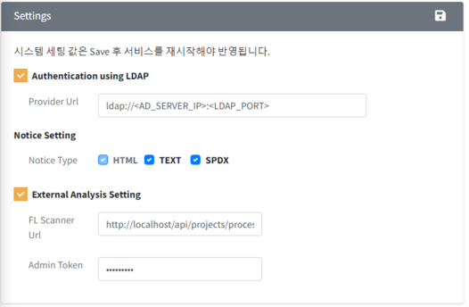

# System (Admin Only)  
Check the FOSSLight Hub logs or change operational data.  
  

## Code Management  
{: .left-bar-title}  
 

Configure FOSSLight Hub operation-related settings.  
- You can search using Code No or Code Name (partial match supported).  
{: .styled-image}   
- When you click a row in the search result list, detailed code information is displayed below.  
    - You can add a new row by clicking the + button at the top left of the table.  
    - You can also double-click a row in the list to switch it to edit mode.  
    - After making changes, click the Save button to apply the modifications.  
    - To cancel edit mode, reselect a row from the Code search result area. This will reset the detailed code section.  
{: .styled-image}     
   

## User Management  
{: .left-bar-title}
  

Check and update the registered account information.  
- **Token Proc > Create** button: Generates a token to be used with the [REST API](https://fosslight.org/hub-guide-en/advanced/2_rest_api_2.html).  
- **Password > reset** button: Resets the password to the same value as the user ID.  
- **Use YN**: Sets the account as inactive.  
- **Admin**: Grants admin rights.  
{: .styled-image}  
   

## History List  
{: .left-bar-title}  
  

View change history for License List, OSS List, and Project basic information.  
- **Search Area**  
    - **Name**: Search by License Name, OSS Name, or Project Name.  
    - **Modifier**: Search by user (action performer).  
    - **Modify Type**: Select License, Open Source, or Project to filter.  
    - **Action**: Select Insert, Update, or Delete to filter.  
    - **Modified Date**: Search change history within a specific period.  
{: .styled-image}  
- **Details**  
    - Double-click a row in the search result to check the details.  
{: .styled-image}   
   

## Notification  
{: .left-bar-title}
 

Manage the popup notification that appears when logging in to the FOSSLight Hub.  
{: .styled-image}  
- **Add**  
    - Click the + button at the top left to add a notification.  
    - **Start Date**: Notification start date  
    - **End Date**: Notification end date  
    - **Publish**: If checked, the notification popup is displayed  
{: .styled-image}  

- **Edit**  
    - Click the row of the notification you want to edit > click the icon at the top left  > modify the content > click the Submit button.  
   

## Sent Mail List  
{: .left-bar-title}
     

Check the mail sending history.  
{: .styled-image}  
   

## Vulnerability Log  
{: .left-bar-title}
     

Check changes in OSS vulnerability data.  
- The vulnerability log is updated when OSS information is changed (e.g., nickname added), when a new vulnerability score is registered, or when a CVE ID with a higher score is added.  
- Use the filter function to check the change history of vulnerability information for a specific OSS (version).  
- Click the CVE ID to go to the CVE detail page on the NVD site.  
{: .styled-image}    
   

## Server Setting  
{: .left-bar-title }
    

{: .styled-image}  

- **Authentication using LDAP**    
    - FOSSLight Hub supports user password authentication using LDAP via JNDI, in environments that support Active Directory or other LDAP servers.  
        - **Provider URL**: Set the LDAP server information in the format ldap://<AD_SERVER_IP>:<LDAP_PORT>. (javax.naming.Context.PROVIDER_URL)

- **Notice Setting**      
    - **Notice Type**: Set the type of OSS notice that can be issued.  
- **External Analysis Setting**  
    - In the Self-Check menu, configure the information for the FOSSLight Scanner Service that will be linked when analyzing the source code via the Upload URL.  
        - FL Scanner URL : Enter the URL of the FOSSLight Scanner Service server to be linked for analysis.  
        - Admin Token : Enter the token of an account with admin privileges. This token value must be the same as the one set in the FOSSLight Scanner Service.  
- **Workspace Path Setting**   
    - **Root Path**: Set the top-level workspace path for upload/download file storage.  
