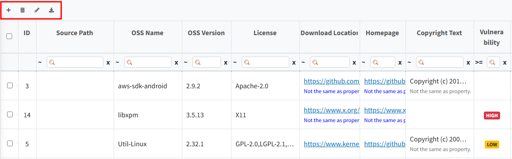
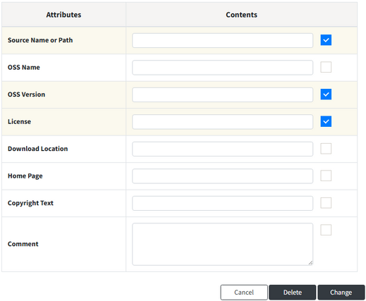
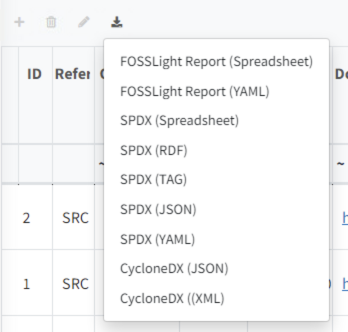
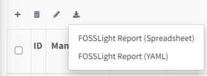

# OSS Table Top Button

There are four buttons at the top left of the OSS Table.
  
- {: width="1%"} : A row is added.
- {: width="1%"} : The selected row is deleted. If you click without selecting a row, all rows will be deleted.
- {: width="1%"} : With the Bulk Edit feature, you can update all selected rows with the same content. 
  When you click Bulk Edit, a popup appears like the one below:
  - Select the item you want to edit, enter the new content, and click Change.
    {: width="80%"}
- {: width="1%"} : Export the OSS Table content in the selected format.
  - For BOM export, it can be generated in various formats for report purposes and SBOM management. 
    {: width="30%"}
  - For tabs other than BOM in the Project, a FOSSLight Report is generated. 
    {: width="30%"}
