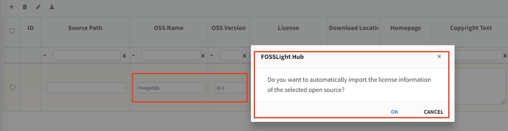

# OSS Information Auto-Fill

If the Open Source is registered in the system, 
you can automatically retrieve the stored information using the OSS Name and OSS Version.

- Enter the OSS Name and OSS Version.
- After entering the Version, a popup will ask if you want to auto-fill. 
  Click OK in the popup to complete the auto-fill.
  