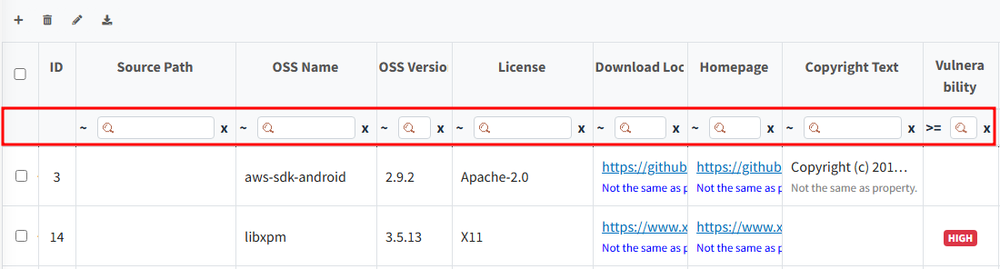

# OSS Table Search
Beneath the header of the OSS Table, there is a filter for searching.
You can use this filter to search for specific values within each column.

- The Filter is composed as follows:
  - Search Conditions:

    | **Character**                                                    | ~        | ==    | !         | ^          | !^                  | !        | !@                | !~               |
    |------------------------------------------------------------------|----------|-------|-----------|------------|---------------------|----------|-------------------|------------------|
    | **Explanation**   &nbsp;&nbsp;&nbsp;&nbsp;&nbsp;&nbsp;&nbsp; | Contains | equal | not equal | begin with | does not begin with | end with | does not end with | does not contain |
  - Search Input Field
  - Clear Search Input Field (x button)
