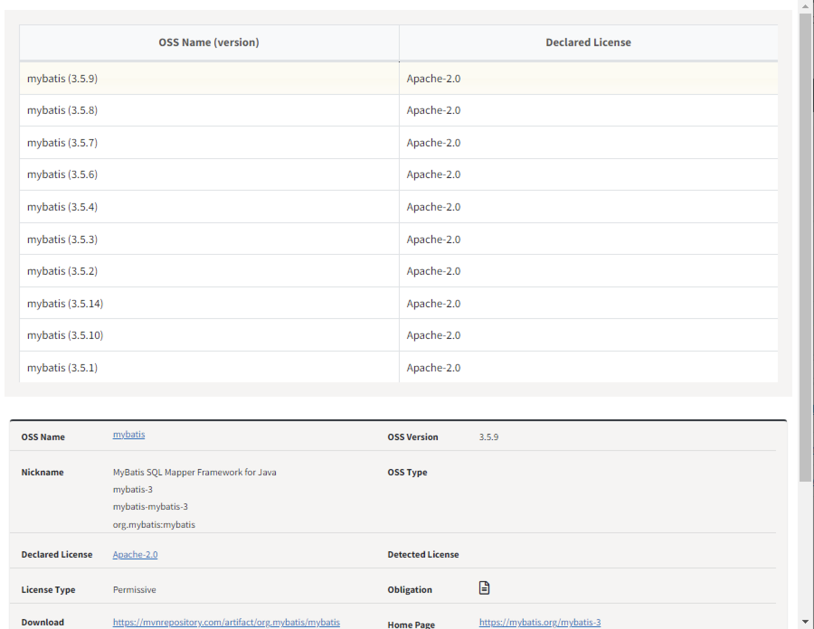

# Viewing OSS Information by Version

When you click the ID of the OSS you want to search, you can view the information for each version of that OSS.

- Note: Open Source detailed information window
  {: width="70%"}