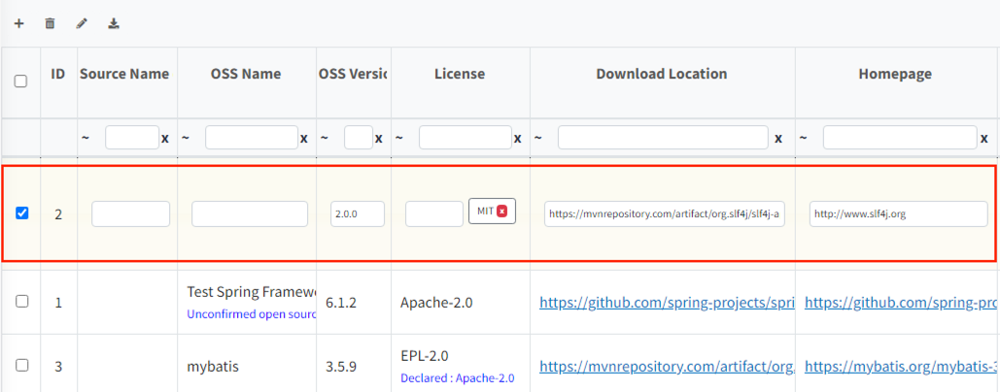

# How to Use the OSS Table

## OSS Table Column Contents
{: .left-bar-title }
- **Source Path** :  Source Path 
- **OSS Name** :  Name of OSS
- **OSS Version** : Version of OSS
- **License** : License name
- **Download Location** :  Website address of downloading OSS
- **Homepage** : Representative website address of OSS
- **Copyright Text** : Copyright text
- **Exclude** : Exclude :  If it is not included in the project to be deployed, this column will be checked. (ex- Build script that is only used at build time and is not loaded into the product.)
- **Vulnerability** :  CVSS Score of OSS  
<th scope="col">※ Open Source Software = OSS</th>
    

## OSS Table Top Button
{: .left-bar-title }
  There are four buttons at the top left of the OSS Table.   
  {: .styled-image}  

**Add a row**
  - Click the  button to add a row.  
  - Fill in the information for each cell in the yellow row. 
  

**Delete a row** 
  - Click the  button to delete a row.   
  - If the button is clicked without selecting a row, everything will be deleted.  

**Bulk Edit** 
 - Click the  button to update all selected rows with the same contents.
    - After selecting the items from the checkboxes, enter the content you want to change and click the "Change" button.  
    - After selecting the items from the checkboxes, click the "Delete" button to remove all content of the selected items from the OSS Table.
        {: .styled-image}  

**Export**
- Click the  button to export the OSS Table contents in the selected format.
    - BOM Tab : You can download the FOSSLight Report and in various formats for the SBOM standard.  
    {: .styled-image}    
    - Tab other than BOM" : You can download the FOSSLight Report.   
    {: .styled-image}      

## Modify OSS Table Cell
{: .left-bar-title }
Double-click the row you want to modify in the OSS table to change to an editable state.  
{: .styled-image}  

**How to modify the license**
- **Add the license** 
  - After double-clicking the row you want to modify, enter the license in the edit box of the license column, then press enter or click on another cell.    
  - Multiple licenses can be entered.     

- **Delete the license** 
  - After double-clicking the row you want to delete, click the 'X'button next to the license name in the cell of the license column.  
  {: .styled-image}        

## OSS Information Auto-Fill
{: .left-bar-title }
If the Open Source is registered in the system, you can automatically retrieve the stored information using the OSS Name and OSS Version.  
- Enter the OSS Name and OSS Version.
- After entering the version, a popup will ask if you want to auto-fill the information. Click OK in the popup to automatically retrieve the data.  
{: .styled-image}    

## OSS Table Search
{: .left-bar-title }
The header of the OSS Table, there is a filter for searching. You can use this filter to search for specific values within each column.  

- The Filter is composed as follows:  
    - Search Input Field()  
    - Clear Search Input Field ()  
    - Search Conditions ()  
<table style="margin-left: 60px;">
    <thead>
        <tr>
            <th scope="col"><strong>Character</strong></th>
            <th scope="col" style="text-align: center;"><strong>Explanation</strong></th>
        </tr>
    </thead>
    <tbody>
        <tr>
            <td>~</td>
            <td>Contains</td>
        </tr>
        <tr>
            <td>==</td>
            <td>equal</td>
        </tr>
        <tr>
            <td>!</td>
            <td>not equal</td>
        </tr>
        <tr>
            <td>^</td>
            <td>begin with</td>
        </tr>
        <tr>
            <td>!^</td>
            <td>does not begin with</td>
        </tr>
        <tr>
            <td>!</td>
            <td>end with</td>
        </tr>
        <tr>
            <td>!@</td>
            <td>does not end with</td>
        </tr>
        <tr>
            <td>! z~</td>
            <td>does not contain</td>
        </tr>
    </tbody>
</table>    

 
## Viewing OSS Information by Version
{: .left-bar-title }
When you click the ID of the OSS you want to search, you can view the information for each version of that OSS.  

- Open Source detailed information window 
  

