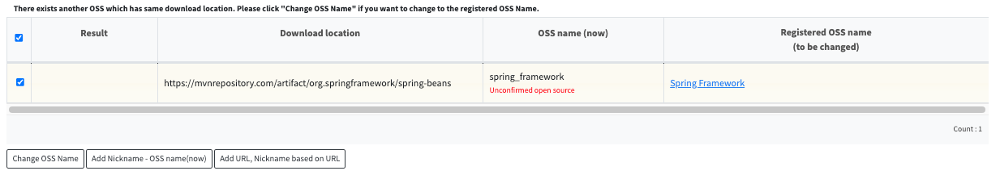

# (Admin Only) Modifying Open Source Information

> **Note**
>
> The buttons **'Add Nickname - OSS name(now)'** and **'Add URL, Nickname based on URL'** are only visible to Admins.
> 
> You can modify the Open Source information listed in the 'Registered OSS name (to be changed)'.
> However, this is only possible if the 'Registered OSS name (to be changed)' is registered in the database, 
> and no additional information will be added for already saved entries.
 

## Adding Nickname or Nickname and URL to Open Source
1. Click on Pre-Review > Open Source.
2. Select the row of the Open Source information you want to modify.
   The Open Source that is to be modified is the one listed under the 'Registered OSS Name (to be changed)' column.
3. Click **'Add Nickname - OSS name(now)'**.
   The value of 'OSS name(now)' will be added as the nickname for the selected Open Source.
   If you want to add both the nickname and the URL simultaneously, 
   click the **'Add URL, Nickname based on URL'** button.

**Pre-Review Table Detailed Features**
- If the specified download location is redirected,
  a recommended OSS Name (Registered OSS Name) is generated based on the redirect URL,  
  and you can check the redirect URL information at the bottom.
- If the download location is inaccessible, a warning message Invalid download location.
  will be displayed under 'Registered OSS name (to be changed)'.
- Clicking on the recommended OSS Name will show detailed information about that OSS.
- If a row is displayed in gray, it means that more than one OSS was found for the same download location.
  You can click the cell of the Registered OSS Name to select the OSS Name you want to change.
- Changes made by clicking 'Change OSS Name' or 'Change License' will be immediately reflected in the OSS Table
  and recorded in the 'Comment'. You can check the change history through the 'Comment'.

  