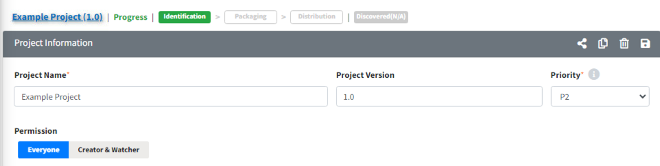

# Information Sharing Button (Share URL)

Click share button({: width="1.5%"}) to share the information of the current item. 
If you do not have view permissions, you can use the Share URL to see an overview of the item. 
However, since this feature is intended for sharing, it will appear as a view-only page where information cannot be edited. 
If you have edit permissions, this page will appear in an editable form. 
You need to log in to view the page shared via the share URL.

**Sharing Example**

1. Click the Share button in Project > Project Information.
   {: width="80%"}

2. You can view the shared page. If you have edit permissions, this page will appear in an editable form.
   {: width="80%"}