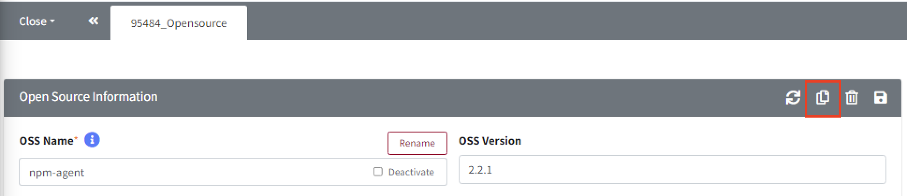
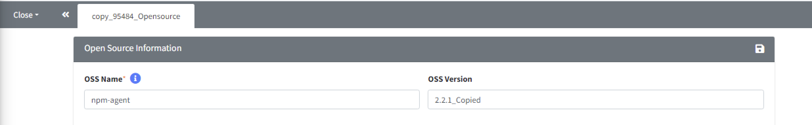

# Copy Button

Click copy button({: width="1.5%"})
to copy the current item. When you click the copy button,
a new tab is created with the contents of the existing item copied. 
After modifying the details as desired, save the changes to store the copied content.

**Copy Example**

1. Click the Copy button on the Open Source detail screen.
   {: width="80%"}

2. You can see the copy_[Open_Source_id]_Opensource tab filled with the copied content.
   {: width="80%"}

3. Update the content with the changes you want to make and click the save button.

> **Note**
> When copying a Project, you can copy it according to the Process stage:
  [Project Copy Tip](../../2_project/3_reuse_project/1_copy_project.md#reusing-a-project-project-copy)