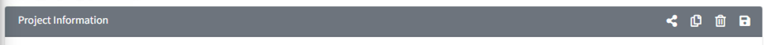
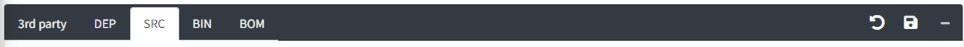
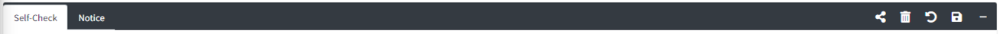

# Common Features of the Detail Screen

Each detail screen provides buttons to control the detail view on the right side of the tab bar. 
The currently available buttons are shown for each menu. Examples for each menu are as follows:

- Project Information:
  

- Project Identification:
  

- Self-Check:
  

