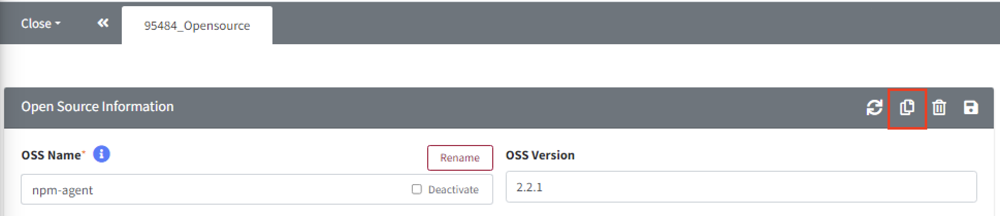
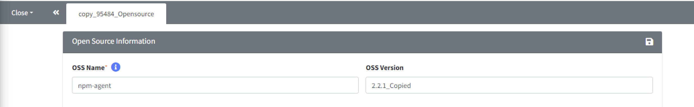

# Common Features of the Detail Screen
In each menu detail screen, there are buttons on the right side of the tab bar() that allows you to control the detail screen. The buttons provided may vary depending on the features of each menu.  
- **Main Menu** 
    - Project Information
    - Project Identification
    - 3rd Party Information 
    - 3rd Party Identification 
    - Self-Check 
   
 
## Information Sharing (Share URL)   
{: .left-bar-title }
- Information Sharing Button :   
- Desription 
    - You can share information about the page that is currently displayed on your screen. 
    - When you do not have view permission, you can check the overview of the item using the Share URL.
    - You need to log in to view the screen shared via the Share URL.  

- Sharing Example
    1. Click the 'Share Button' in Project > Project Information.  
    {: .styled-image}
    2. You can view the shared screen. (If you do not have edit permissions, it will appear as a view only mode.)
    {: .styled-image}
   

## Copy 
{: .left-bar-title }
- Copy Button :   
- Desription
    - You can copy the page that is currently displayed on your screen.    
    - When you click the 'Copy Button', a new tab will be created with the content of the existing page copied.  
    - After modifying the details and saving, the copied content will be saved.  
- Copy Example  
    1. Click the 'Copy Button' on the Open Source details screen.  
    {: .styled-image}  
    2. You can see the **copy_[Open_Source_id]_Opensource** tab filled with the copied content.    
    {: .styled-image}  
    3. Update the content with the changes you want to make and click the save button.  

- **Note**  
    - [Project Copy Tip](../../2_project/3_reuse_project/1_copy_project.md#reusing-a-project-project-copy) :  When copying a project, you can copy it according to the process stage.  
   

## Delete   
{: .left-bar-title }  
- Delete Button :    
- Desription  
    - You can delete the page that is currently displayed on your screen.  
    - If you do not have edit permissions or if the item cannot be deleted (e.g., when the project is in a complete status), the delete button will not be visible.  
   

## Save    
{: .left-bar-title }  
- Save button:   
- Desription  
    - You can save the page that is currently displayed on your screen. 
    - If you do not have edit permissions or if the item cannot be modified, the save button will not be displayed.  
   

## Reset  
{: .left-bar-title }  
- Reset Button :   
- Desription  
    - You can reset the page that is currently displayed on your screen.
    - This button is only displayed on pages where analysis information is entered. You can find it in the Identification of the Project, 3rd Party SW, and Self-Check menus.  
   

## Sync    
{: .left-bar-title }  
- Sync Button :   
- Desription
    - This feature is only available on the Open Source screen. For detailed instructions, refer to [Open source Sync Guide](../../../menu/3_oss.md#update-information-for-each-oss-version-at-once).