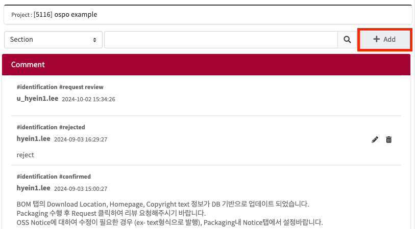
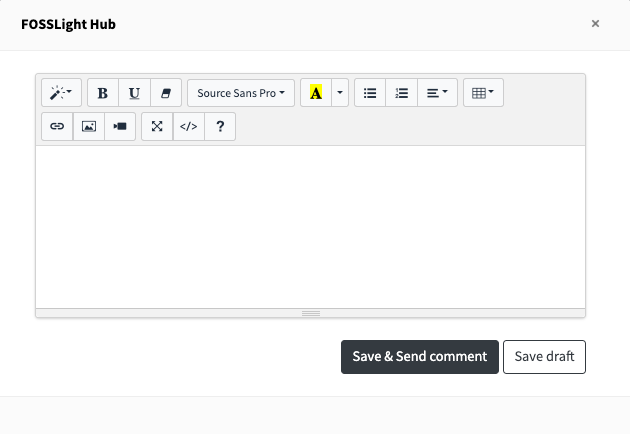

# Adding a Comment

## Comment View
You can add a comment by clicking the  button.

## Comment Window
If you are viewing comments in a separate window, you can add a comment by clicking the **'+ Add'** button.

## Comment Writing Popup

1. A popup will appear where you can leave a comment.
2. After writing your desired comment, click **'Save & Send Comment'**.
3. If you want to temporarily save the comment, click **'Save Draft'**.
   When you click the Add button again to open the comment writing popup, 
   the comment you were previously writing will still be there.