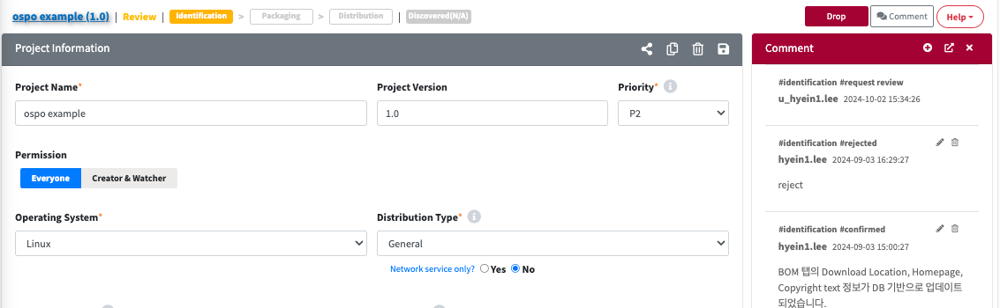
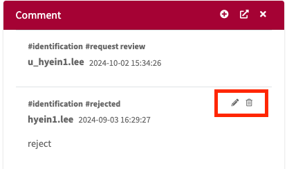

# Comment
On the right side of the detailed screen of each menu, you can find the Comment for communication between the reviewer and the user, as well as for history management. 
{: .styled-image}  
- **Main Menu** 
    - License
    - Open Source
    - Project
    - 3rd Party
   

## Comment View
{: .left-bar-title }
-  button serves as a toggle,  allowing the Comment Window to be displayed or hidden.
    

## Write Comment
{: .left-bar-title }  
1. Click the 'Add Button' .  
2. Enter the content in the comment popup.  
    - **Save & Send Comment** : After the content is saved, it will be sent to both the reviewer and the user(who has permission to create and modify projects)'s via email.  
    - **Save draft** : A temporary comment will be saved. When you click the Add Button again, a comment window will appear with the previously written content.  
      
    

## Add and Delete Comment 
{: .left-bar-title }
- You can edit and delete the previously written comment.  
    - When you click  button, a popup will appear that allows you to edit the comment. After making your changes, click the 'OK' button to save.  
    - When you click  button, you can delete the comment.
    {: .styled-image}
    

## Separate Comment Window
{: .left-bar-title }
- When you click  button, you can separate the comment into a separate window for use. In this case, you can use the **'+Add'** button to add comments.  
   

