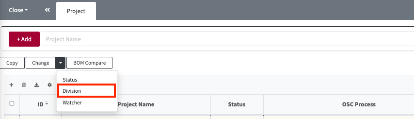

# Changing Division

You can change the Division for multiple Projects or 3rd Party SW at once using the 'Change' > 'Division' button. 
Division changes are only possible for projects you have permission for.

- Applicable menus: Project, 3rd Party
  

**How to Change:**

1. Select the projects you want to change from the list.
2. Click the Change button and click Division.
3. Select the Division you want to change to and click OK.