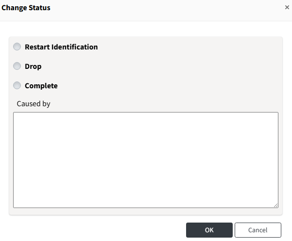

# Change Division, Watcher, Status

## Changing Division

You can change the Division for multiple Projects or 3rd Party SW at once using the 'Change' > 'Division' button. 
Division changes are only possible for projects you have permission for.

- Applicable menus: Project, 3rd Party
  
**How to Change:**

1. Select the projects you want to change from the list.
2. Click the Change button and click Division.
3. Select the Division you want to change to and click OK.

## Changing Watcher

You can change the Watcher for multiple Projects or 3rd Party SW at once using the 'Change' > 'Watcher' button.
Watcher changes are only possible for projects you have permission for.

- Applicable menus: Project, 3rd Party
  

**How to Change:**

1. Select the projects you want to change from the list.
2. Click the Change button and click Watcher.
3. Enter the Watcher information you want to change to and click OK.

## Changing Status
> **Note**
>
> Status changes are only supported from the Project list.

You can change a project's status using the 'Change' > 'Status' button.
Status changes are only possible for projects you have permission for.
- Applicable menus: Project
  

**How to Change:**
1. Select the project you want to change from the list.
2. Click the Change button and click Status.
3. Choose the desired status and click OK.

**Available Status Types:**

The types of status you can change vary by user role.
- User:
  - Can change the project to Drop or Restart Identification status.
- Admin:
  - Can change to Drop, Restart Identification, or Complete status.