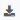
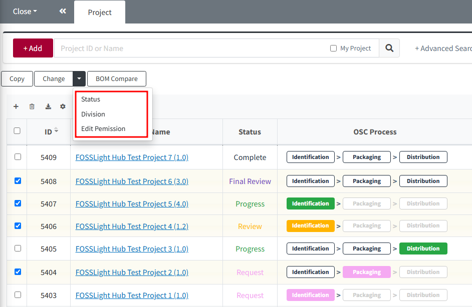
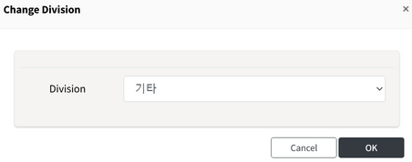
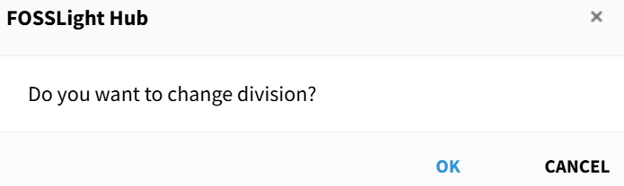
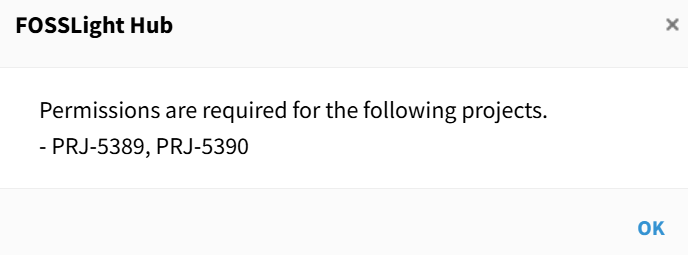
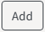
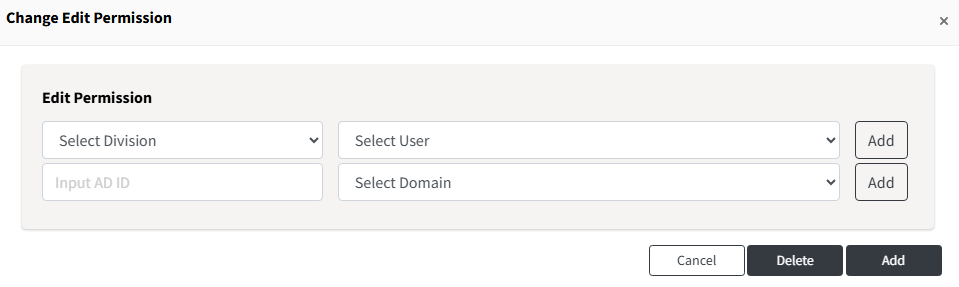
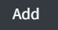
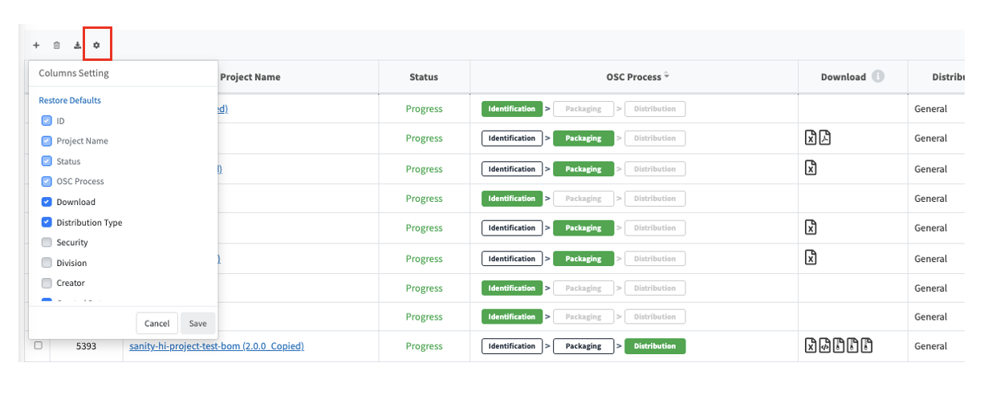
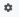

# Common Features in the List View

## Export Project Search Results  
{: .left-bar-title }
- Click the  button at the top left of the list to export the currently displayed search results in each menu as an Excel file.  
- The total number of search results is shown at the bottom right.  
- Export is not available for results exceeding 5000 items.  
- **Main Menus**  
    - Open Source  
    - License  
    - Project  
    - 3rd party  
    - Self-Check  

  
   

## Change Division, Edit Permission, and Status  
{: .left-bar-title }  
- You can use the Change button at the top of the menu to change the information of the selected projects.   
- You must have Edit Permission for the selected projects to make changes.  
- **Main Menus**: Project, 3rd Party (Status change not available)  
   

### Change Division  
{: .specific-title }  
- You can change the Division of multiple projects at once.  
- **How to change**  
  1. Select the projects that you want to change > Click the Change button > Click Division.  
  2. Choose the new Division and click OK.  
      
  3. Click the OK button again.  
      
    If even one of the selected projects does not have Edit Permission, a popup will display the project ID without permission, and the Division will not be changed.    
          

### Change Edit Permission  
{: .specific-title }
- You can add or remove Edit Permissions for multiple projects at once.  
- **How to change**  
  1. Select the projects > Click the Change button > Click Edit Permission.  
  2. Select the user to be added as Edit Permission and click the  button.  
     
    - **Select Division**: You can select the users by Division.  
    - **Input AD ID**: You can enter an AD account and select the domain to add a user.  
  3. Click the  button and then click OK.  
  To remove existing Edit Permission users, select the users and click the  button.  

### Change Status  
{: .specific-title }
- You can change the Status of a project.  
- **How to change**  
  1. Select the projects you want to change the Status from the project lists.  
  2. Click the Change button > Click Status.  
  3. Select the Status you want to change to, enter the reason, and click OK.  
     

- **Available Status Types**  
  - The available Status types differ depending on the user's role.   
    - **General User**: You can change project Status to Drop or Restart Identification.    
    - **Admin**: You can change project Status to Drop, Restart Identification, or Complete.    
   

## Custom Columns  
{: .left-bar-title }  
- In each menu's list view, you can customize and save the columns displayed in the list view individually.    
{: .styled-image}  

- **Applicable Menus**  
  - License  
  - Open Source  
  - Project  
  - 3rd party  
  - Self-Check  
 

- **Default Columns**  
  The default column settings for each menu are as follows.
  - **License**: License Name, Restriction, Notice, Source  
  - **Open Source**: ID, OSS Name, OSS Version, License Name, Notice, Source  
  - **Project**: ID, Project Name, Status, OSC Process, Download  
  - **3rd party**: ID, 3rd Party Name, Software Name (Version), Status  
  - **Self-Check**: ID, Project Name (Version)  
 

- **How to Add or Remove Columns**  
  - Click the  button at the top left of the grid > Select or deselect the columns you want > Click Save.  
  - The selected columns will be saved and loaded the next time you log in.
