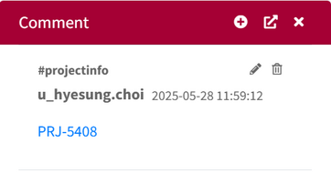
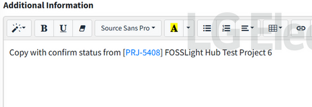
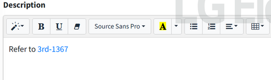
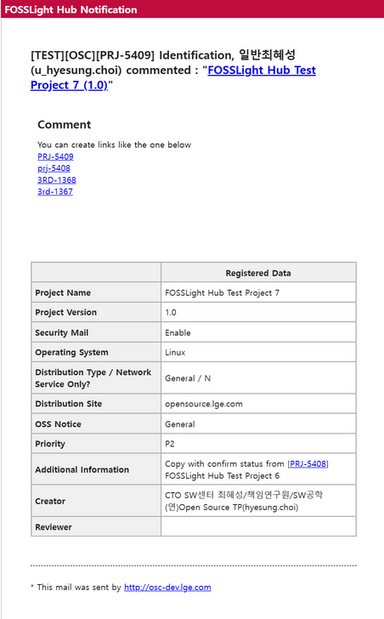

# Adding Project & 3rd Party Links 
- You can add links that connect to projects and 3rd parties.  
- When you click the link, it will open a new window with the "Share URL" link.    
  

## How to Create Links  
{: .left-bar-title }  

- Text Patterns  
    - **PRJ-ID** or **prj-ID**  
    - **3RD-ID** or **3rd-ID**  
- Menus Where Links are usable  
    - Comment History 
        - Project, 3rd Party, Open Source(Admin Only), License(Admin Only)  
        {: .styled-image }  
    - Project > Project Information > Additional Information  
    {: .styled-image }  
    - 3rd party > Description  
    {: .styled-image }  
    - E-mail (Enterprise Only)  
    {: .styled-image }     
        