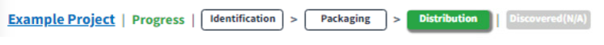
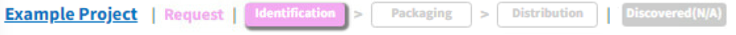
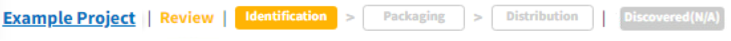
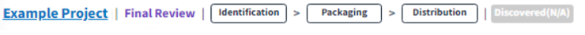
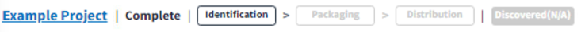
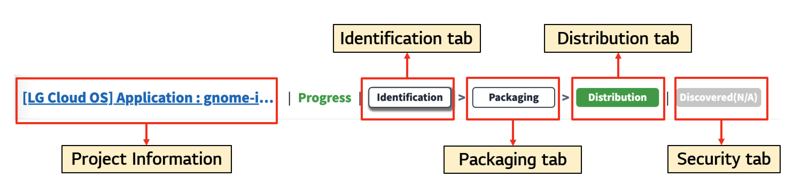

# Top Status Bar

The top status bar of the project allows you to easily check the current status and navigate to each stage.

> **Note**
> 
> Distribution is a LGE-only feature.

- You can check the status of the project. Here are some examples:
  - Progress (Distribution):  
    {: width="60%"}
  - Request (Identification):  
    {: width="60%"}
  - Review (Packaging):  
    {: width="60%"}
  - Final Review:  
    {: width="60%"}
  - Complete:  
    {: width="60%"}

- By clicking the buttons, you can navigate to the screen for each stage.  
  {: width="80%"}