# Project Status  

## Navigate Project Status  
{: .left-bar-title }  
- From the Project List, you can click on the Project Name or any OSC Process step (Identification, Packaging, Distribution) to move to the respective tab.  
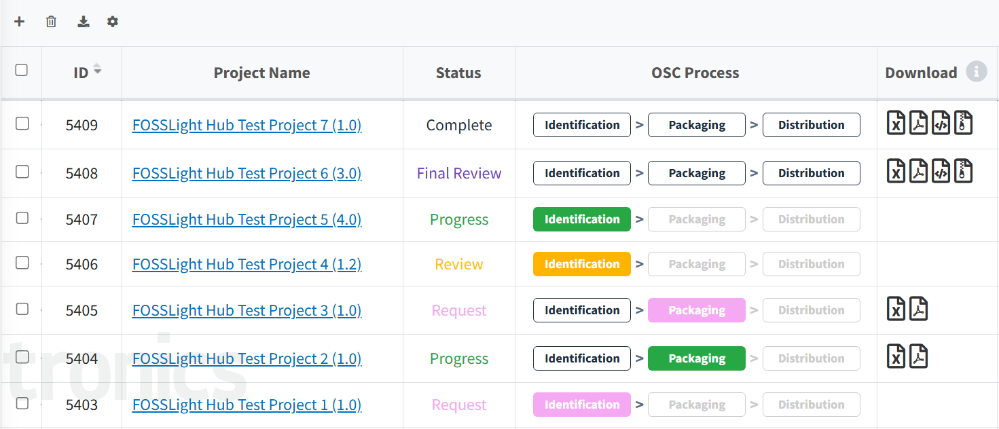  
- You can also check the Project Status from the top status bar of each stage and click to move directly to that step's tab.  
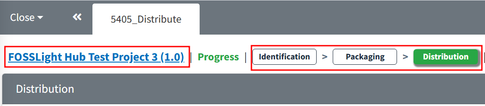  
   

## Self-Reject  
{: .left-bar-title }  
- If the Project Status is  and changes are needed in the Identification or Packaging stages, you can change the Project Status.  
  1. In the Identification (BOM) or Packaging step, click the  button at the top right.  
  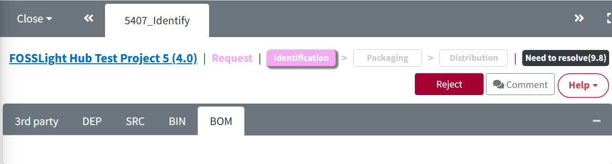  
  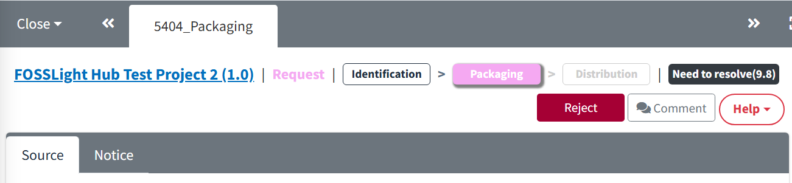  
  2. Enter the reason for the changes and click OK. The Project Status will be changed to 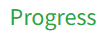.  
  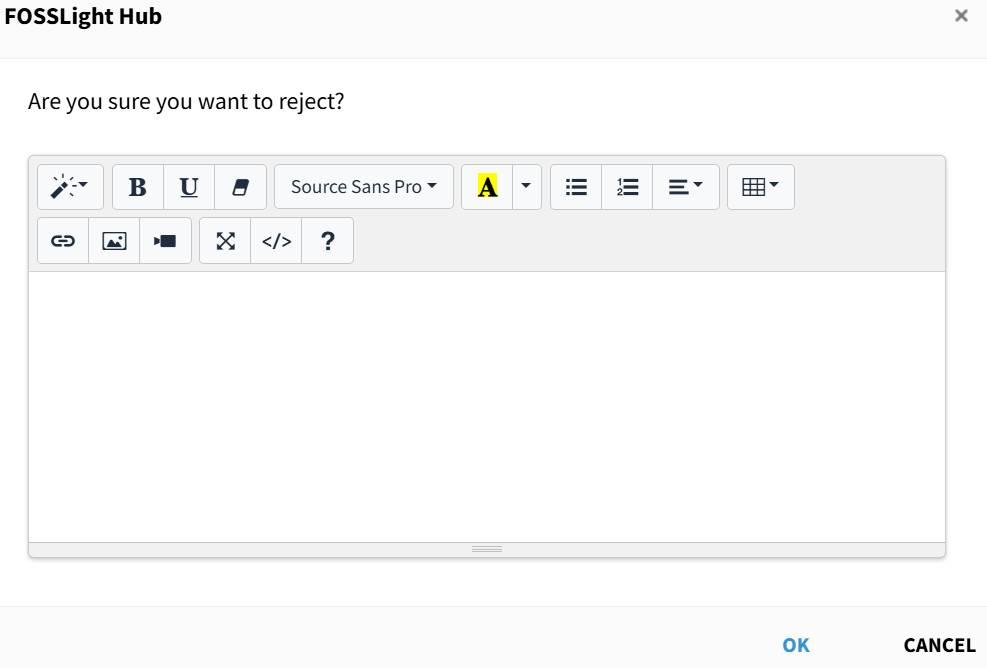  
   

## Reopen  
{: .left-bar-title }  
- If the Project Status is 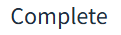, you can request to change the status to  using Reopen.
  1. Click the Project Name in the Project List to go to the Project Information tab.  
  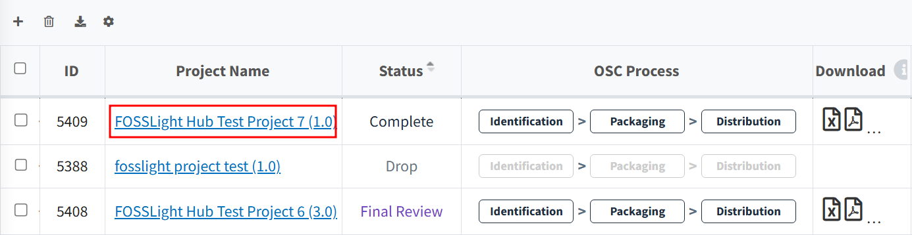  
  2. In the Project Information tab, click the  button at the top right.  
  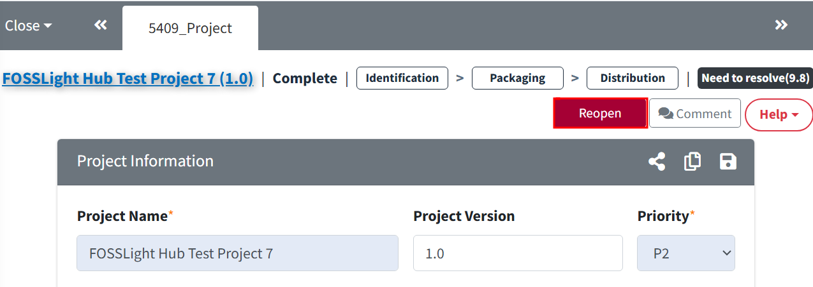  
  3. Enter the reason for the change, select the step (Identification or Packaging) that needs to be reprocessed, and click OK.  
  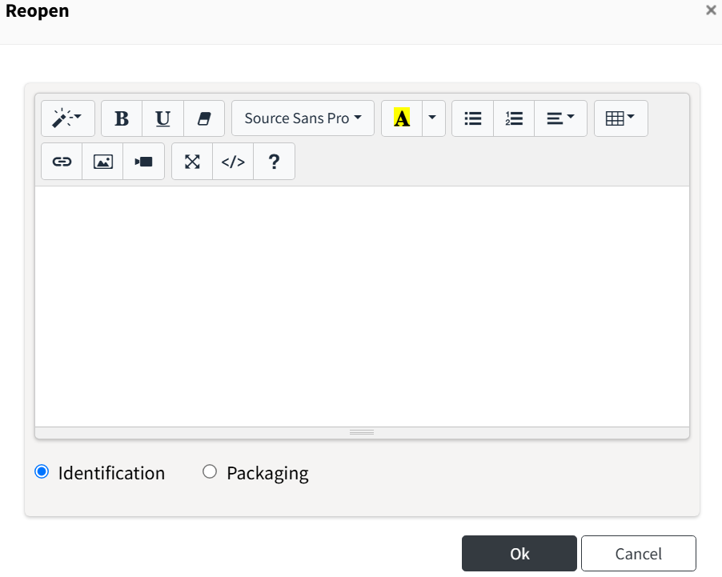  
   

## Drop & Reopen  
{: .left-bar-title }

### Drop  
{: .specific-title }  
- If the OSC Process for a project is no longer needed, you can terminate the project.    
  1. In the Project Information tab, click the  button at the top right. If the Project Status is , the Drop is not available.  
  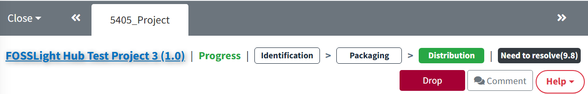  
  2. Enter the reason for dropping the project and click OK.  
  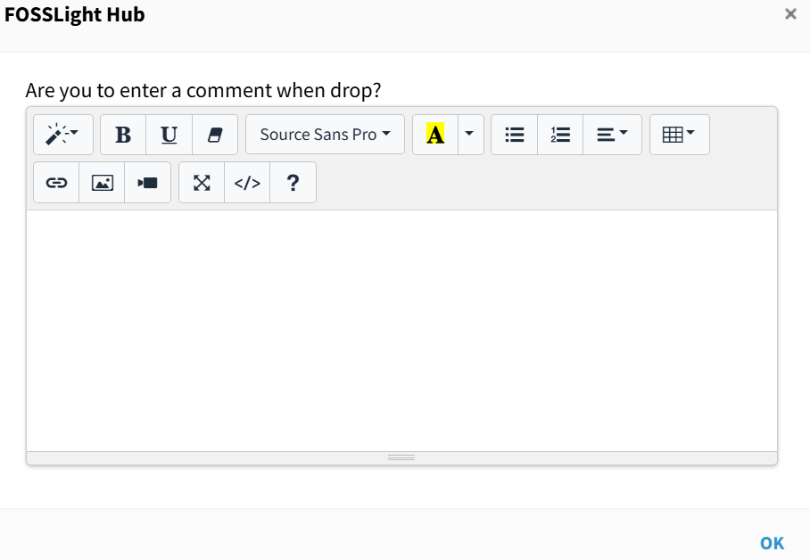  

### Reopen  
{: .specific-title }  
- If the Project Status is Drop, but you need to resume the OSC Process, you can reopen the project.  
  1. In the Project Information tab, click the 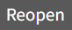 button at the top right.  
  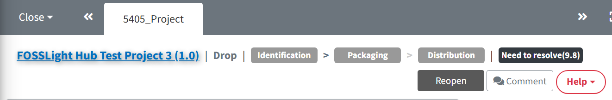
