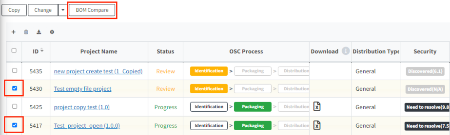

# BOM Comparison Between Projects (Bom Compare)

This feature allows you to compare the BOMs of two projects.
You can see the changes between the previous and current project versions.

**How to Compare BOMs**

1. Select the two projects you want to compare from the project list.
2. Click the BOM Compare button.
   {: width="80%"}
3. A tab showing the BOM comparison will appear. You can check the differences between the before and after projects.
   {: width="80%"}