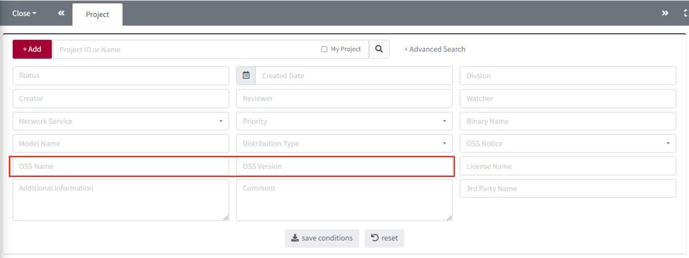
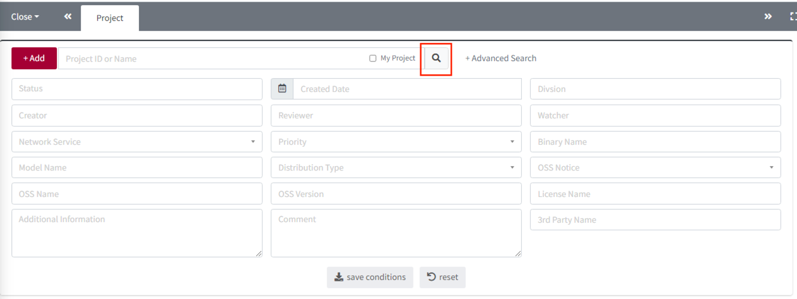

# Search for Projects Containing Specific Open Source

You can search for projects that include a specific open source using search criteria.

1. Click Advanced Search in the Search window.
   
2. Enter the open source information you want to search for in OSS Name and OSS Version.
   
3. Click the Search button.
   
4. You can see a list of projects that include the open source you entered in step 2.