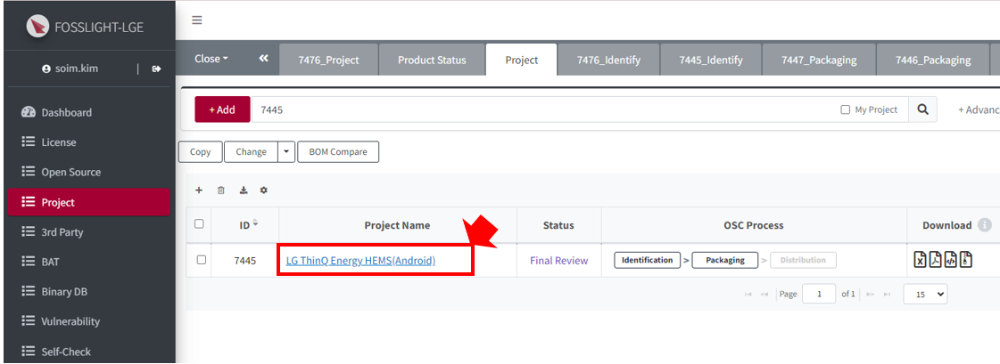
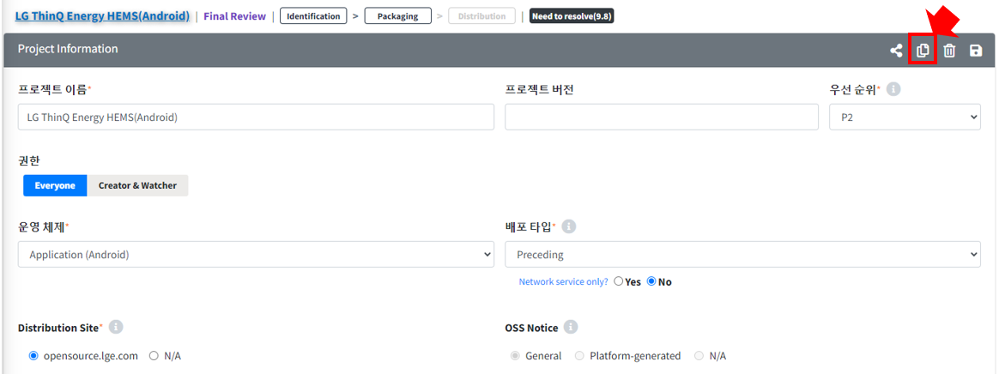
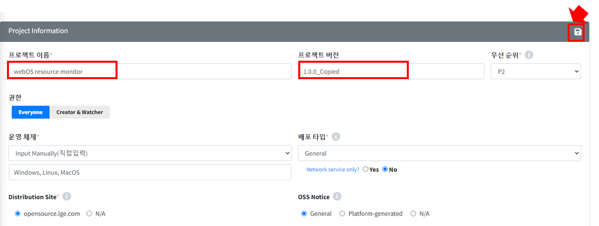
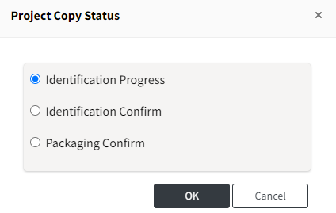
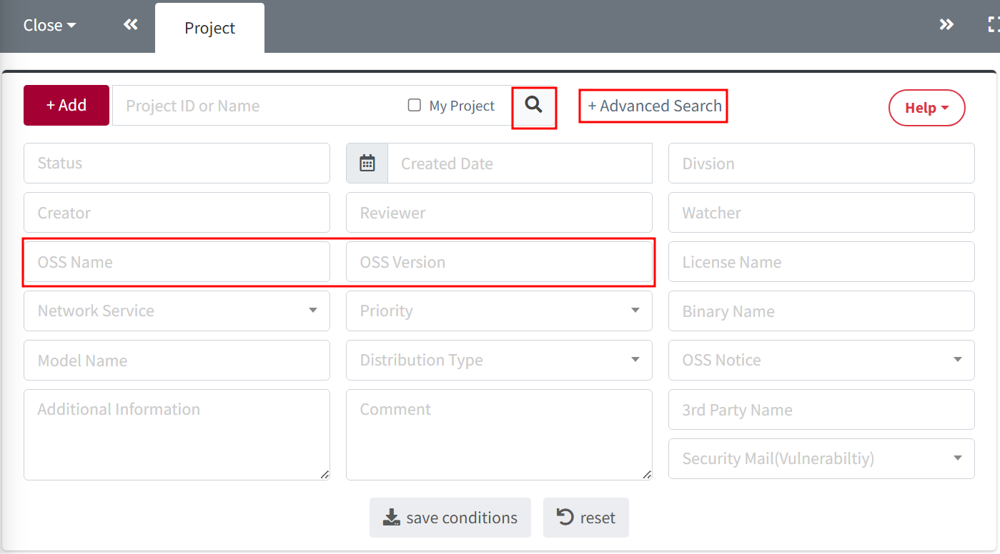

# How to Use Project

## BOM Compare
{: .left-bar-title }  
- This function allows you to compare the BOM of two projects to check the OSS components that have been added, changed, or deleted between projects.  
- **How to Use BOM Compare**  
    1. Select two projects to compare from the 'Project list'.    
    2. Click the 'BOM Compare' button.    
     
    3. In the BOM comparison tab, you can check the differences between the before and after projects.    
     
   

## Project Copy   
{: .left-bar-title } 
- If there is a derived model that uses similar software to that used in an existing project, you can reuse a previously registered project.  
- **How to Copy a Project**  
    1. Click the name of the project you want to copy to open the 'Project Details' tab.     
         
    2. In the 'Project Details' tab, click the 'Copy' button to duplicate the project.      
         
    3. In the copied 'Project Details' tab, enter the project name and version, and then click the 'Save' button.     
      
    If the project's identification has been confirmed, 'Status' selection options will be available for the copied project.   
     
    4. The copied project will appear in the 'Project List'.   
   

## Search Projects Containing a Specific Open Source  
{: .left-bar-title }  
- You can search for projects containing a specific open source component using search conditions.     
    1. Click 'Advanced Search' in the search window.    
    2. Enter the open source information in 'OSS Name' and 'OSS Version'.    
    3. Click the 'Search' button.    
        
    4. You can check the list of projects that contain the open source entered in step 2.    
