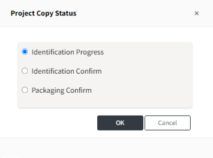

# Reusing a Project (Project Copy)

You can copy a project to reuse previous analysis content. This is useful when there are not many changes 
in the Open Source list while updating the program version, 
or when the Open Source version is the same but the packaging files have been modified.

**How to Copy**

1. Click on the project you want to copy.
2. Click the Copy icon at the top.
3. Modify the Project Name or Version and any other desired information, then save.
   - You cannot save the Project Name and Version as the same as the previous one.

**Selecting the Process Stage to Copy**

When copying, you can select the stage to copy. (Refer to the OSC Process stages: [Project Menu Guide](../../../menu/4_project.md))

- Identification Progress: Select this if the Open Source used has changed and needs to proceed from the Identification stage.
- Identification Confirm: Select this if packaging files or notices need to be modified.
- Packaging Confirm: Select this if there are no changes from the existing project.