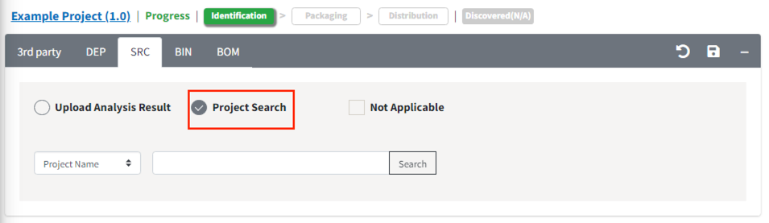
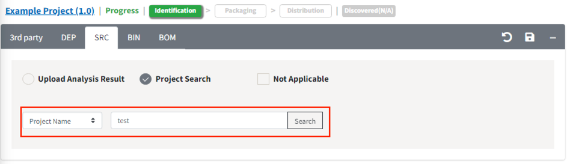
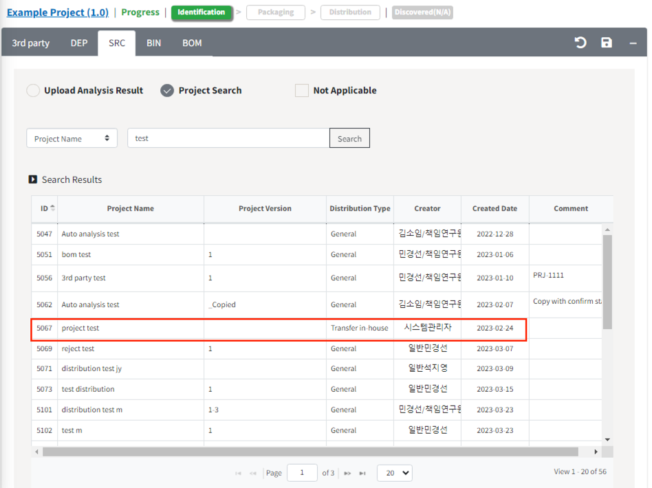
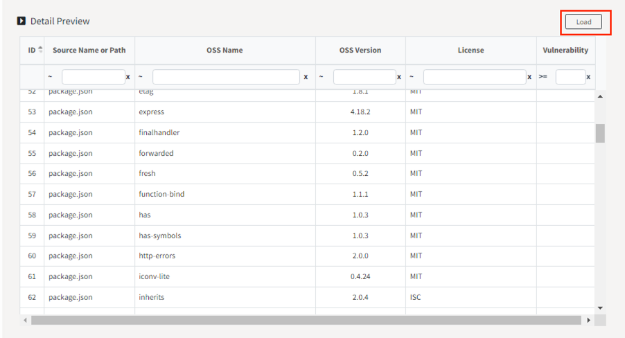
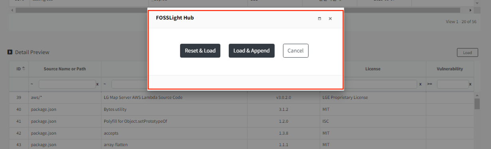

# Importing Analysis Results from Other Projects

You can import previously analyzed project results and apply them to a new project. 
This feature is useful in the following scenarios:

1. When a project is divided into multiple modules, and each module's open source analysis is performed separately, 
   then combined for management.
2. When there are multiple projects utilizing common modules.

- How to Import Previous Project Analysis Results:
 
You can load each results in the 3rd party, SRC, DEP, and BIN tabs of the Identification stage.
 
Note: Only projects with the **Identification stage completed** can be imported.

1. Click the tab where you want to load the analysis results.
2. Click the Project Search button.
   {: width="80%"}
    - If you are in View mode, click the Edit button ({: width="1.5%"}) 
      to see the Project Search button.
3. Choose your search criteria and enter the desired search term.
   {: width="80%"}
4. Select the project you want to import from the search results.
   {: width="80%"}
5. The Detail Preview menu will appear below the search list, showing the list of open source components to be loaded.
   Click the Load button.
   {: width="80%"}
6. Choose the desired import method in the popup.
   {: width="80%"}
    - Reset & Load: Clears the existing contents in the OSS table and loads the open source list from the selected project.
    - Load & Append: Keeps the existing contents in the OSS table and adds the open source list from the selected project.