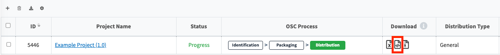

# How to Download OSS Notices

Once the Packaging stage is confirmed, you can download the OSS notices. 
However, depending on the project's Distribution type, OSS notices may not be issued
(e.g., Transfer-in-hose, Preceding SW).

Here’s how to download the issued notices:

- Click the icon ({: width="1.5%"}) 
  in the Download column of the Project list.
  {: width="80%"}

- Alternatively, if you are viewing Project Information through a Share URL, you can see the files available for download.
  {: width="60%"}

