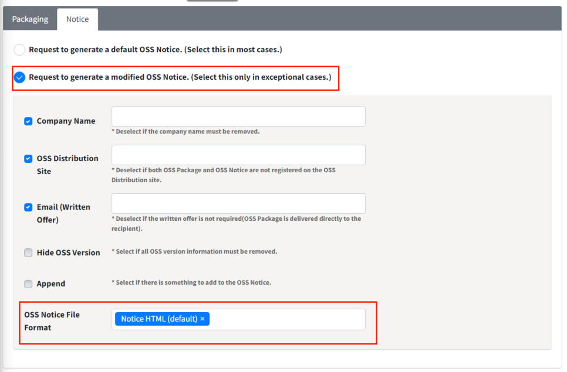

# How to Issue OSS Notices in Different Formats

If you need to issue OSS notices in formats other than the default HTML format, 
you can select the desired format in the Notice tab during the Packaging stage.

- How to Select in the Notice Tab:
  - 