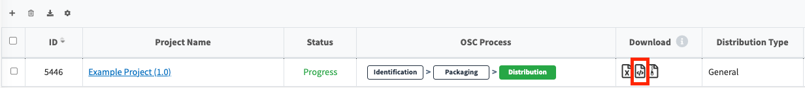
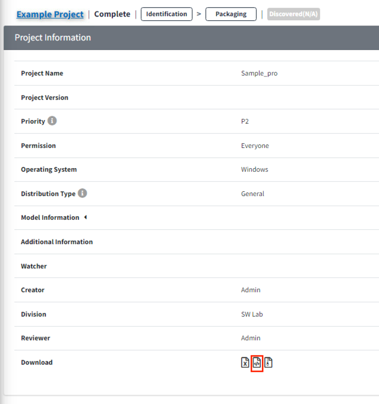

# Types of OSS Notices and How to Download Them

## What is an OSS Notice?
{: .left-bar-title }  
- An OSS Notice is a document that lists the open source software used and their licenses, provides instructions on how to obtain the source code, and includes the full text of each license.  
   

## How to Download an OSS Notice
{: .left-bar-title }
- OSS Notices can be downloaded once the packaging stage is confirmed.  
    - OSS Notices may not be issued depending on the project's distribution type (e.g., internal transfer, advanced development, etc.).

- **How to download an issued notice**  
    - Method 1. Click the icon ({: width="10px" height="12px"}) in the Download column of the Project list.  
  {: width="700px" height="100px" .styled-image }  
    - Method 2. When checking Project Information through a Share URL, click the icon ({: width="10px" height="12px"}) in the Download section.  
    {: width="400" height="500" .styled-image }  

   

## Types of OSS Notices
{: .left-bar-title }
- The following are types of OSS Notices that can be issued from FOSSLight Hub.  
    - HTML  
        - A general OSS notice format that displays OSS Name, OSS Version, License, Copyright text, License text, and Homepage.  
        - Example: [OSS Notice HTML](../../oss_notice_format/OSSNotice-4022_Sample%20Project_2021_20211230211005.html)
    - Text  
        - Contains the same contents as the Html format, but output as a plain text file.  
        - Example: [OSS Notice Text](../../oss_notice_format/OSSNotice-4022_Sample%20Project_2021_20211230211007.txt)
    - Simple HTML  
        - Same as the HTML notice, but replaces the full license text with links to the license text.  
        - Example: [OSS Notice Simple HTML](../../oss_notice_format/simple_OSSNotice-4022_Sample%20Project_2021_20211230211010.html)
    - Simple Text  
        - Same as Simple HTML, but in text file format.  
        - Example: [OSS Notice Simple Text](../../oss_notice_format/simple_OSSNotice-4022_Sample%20Project_2021_20211230211012.txt)
    - SPDX(fileformat)  
        - Outputs the OSS Notice in various file formats supported by SPDX. 
        - Example: 
            - [OSS Notice SPDX (SpreadSheet)](../../oss_notice_format/SPDXRdf-SampleProject-2021_20211230.xls)
            - [OSS Notice SPDX (RDF)](../../oss_notice_format/SPDXRdf-SampleProject-2021_20211230.rdf)
            - [OSS Notice SPDX (TAG)](../../oss_notice_format/SPDXRdf-SampleProject-2021_20211230.tag) 
            - [OSS Notice SPDX (JSON)](../../oss_notice_format/SPDXRdf-SampleProject-2021_20211230.json)
            - [OSS Notice SPDX (YAML)](../../oss_notice_format/SPDXRdf-SampleProject-2021_20211230.yaml)
    - CycloneDX(fileformat)  
        - Outputs the OSS Notice in various file formats supported by CycloneDX.   
            - [OSS Notice CycloneDX (JSON)](../../oss_notice_format/CycloneDX-testproject.json)  
            - [OSS Notice CycloneDX (XML)](../../oss_notice_format/CycloneDX-testproject.xml)  
   

## How to Issue in a Different Format
{: .left-bar-title }
- If a format other than the default HTML format is needed, you can select it in the Notice tab during the Packaging stage.  
    - How to select in the Notice tab:  
    {: .styled-image }
