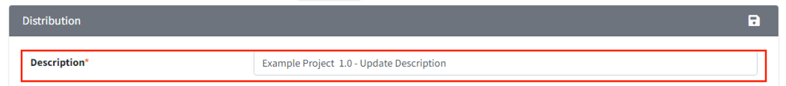

# Description Update

1. Go to the Distribution tab.
2. Edit the Description to your desired content and then save it by clicking the Save button
   ({: width="1.5%"}).  
   {: width="80%"}
3. After verifying the updated information on the Distribution Information (To be updated) screen,
   click the "Distribute" button.  
   