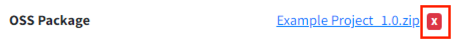
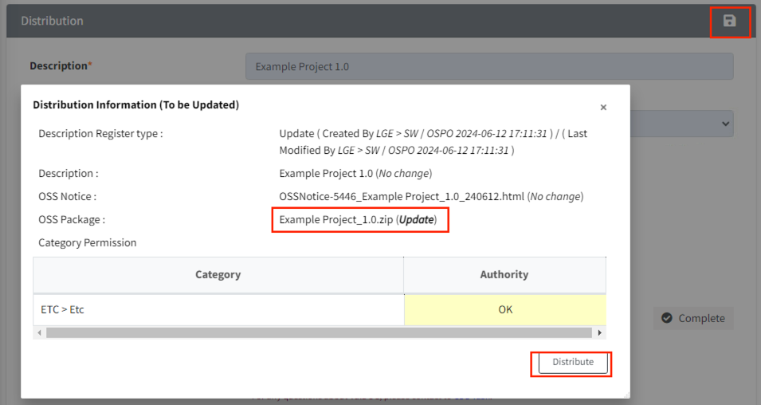

# OSS Package Update Guide

This guide is used when you need to make minor changes to a completed OSS package distribution 
(e.g., updating the README file).

1. Go to the Distribution tab.
2. Click the 'X' button on the right side of the package file you want to edit.  
   {: width="45%"}
3. Click the Upload button to upload the updated OSS package file. 
   Once the file is successfully uploaded and marked as 'updated', click the Start to Verify button.  
   {: width="80%"}
4. If the verification is successful, the button will change to Completed as shown below.  
   {: width="80%"}
   - If the verification fails, a popup will appear asking if you want to retry.
   - If it continues to fail, check if the uploaded file matches the path information specified in the Packaging tab.
5. Click the Save button ({: width="1.5%"}) 
   in the Distribution tab. After verifying the updated information on the Distribution Information (To be updated) screen,
   click the "Distribute" button.  
   {: width="80%"}