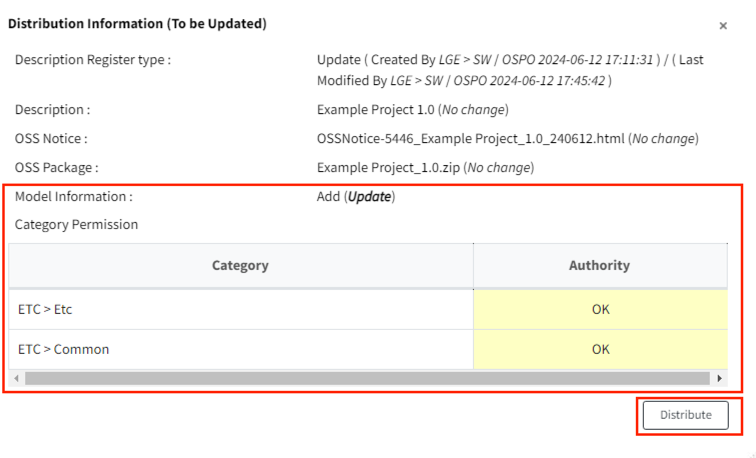

# Model Information Update

1. Go to the Distribution tab.
2. Use the add/delete buttons in the Model Information section to modify the model information.  
   {: width="80%"}
3. Click the Save button ({: width="1.5%"})
   in the Distribution tab. After verifying the updated information on the Distribution Information (To be updated) screen, 
   click the "Distribute" button.  
   {: width="80%"}