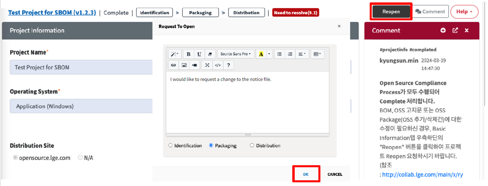

# OSS Notice Update

To update the notice, you need to **redo the Packaging stage**.

1. Click the "Reopen" button in the Project Information section.
2. In the Reopen popup, select "Packaging", write the reason for the request, and click OK.  
   
3. Once the reviewer approves the Reopen request, go to the Packaging tab, update the notice with the new information, 
   and request a review.
4. After the Packaging stage is completed, proceed with the Distribution again.
