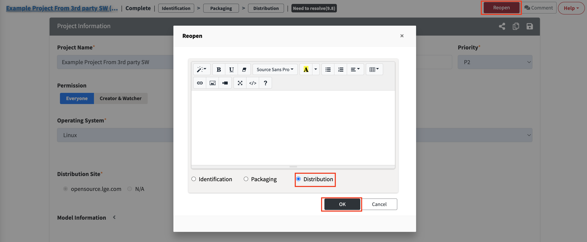

# Distribution Cancellation

To cancel the distribution, follow these steps:

1. Click the "Reopen" button in the Project Information section of the completed project.
2. In the Reopen popup, select "Distribution", write the reason for rejection, and click OK.  
   {: width="80%"}
3. Once the reviewer approves the Reopen request, the Distribution stage will be canceled.